layout: true
  
<div class="my-footer"><span>


<a href="https://www.linkedin.com/in/hsvab/">LinkdIn</a> |
<a href="https://twitter.com/hsvab">Twitter</a> | 
<a href="https://www.instagram.com/haydeesvab/">Instagram</a> |
<a href="https://www.facebook.com/haydee.svab/">Facebook</a> |
<a href="https://github.com/hsvab">GitHub</a>


</span></div> 


---
class: center, middle

## Apresentações


---
class: split-two with-border
.column.bg-main1[.content[

<BR><BR>

- Cientista de Dados e Pesquisadora em

Mobilidade Urbana e Cidades Inteligentes

- CEO da ASK-AR

Consultoria em análise de dados

- Já trabalhei como consultora pra BID,

Banco Mundial, IDEC, entre outros

- Mestra em Engenharia e

Planejamento de Transportes (Poli-USP)

- Engenheira Civil (Poli-USP)

- Email: <a href="mailto:hsvab@hsvab.eng.br">hsvab@hsvab.eng.br</a>

]]

.column.bg-main2[.content[

<br>

## Haydée Svab

```{r echo=FALSE, out.width="30%"}

```

]]

--

## E vocês?

---
class: center, middle

## Agenda

---
class:

# Agenda do Curso

- Aula 1: Introdução ao R e ao RStudio

- Aula 2: Primeiros passos com R e o pacote tidyverse

- Aula 3: Abrindo e manipulando dados

- Aula 4: Estatísticas básicas

- Aula 5: Visualizando dados

- Aula 6: Markdown

- Aula 7: Comunicando resultados


---
class:    

# Agenda de hoje

- Apresentações

- Agenda

- Acessando a RStudio Cloud

- Algoritmos

- Programação

- R - uma visão geral

- Introdução ao RStudio

- Boas práticas

- Dicas finais


---
class: center, middle

## Acessando a RStudio Cloud


---
class: center

```{r setup, include=FALSE}
options(htmltools.dir.version = FALSE)

knitr::opts_chunk$set(fig.align = "center", message=FALSE, warning=FALSE)

library(tidyverse)

```

# RStudio Cloud

### - Criar conta na `RStudio` Cloud


```{r, echo=FALSE, out.width="40%"}
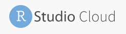
```
Link: [https://rstudio.cloud/](https://rstudio.cloud/)

### - Acessar link do projeto

Link: [https://bit.ly/rstudiocloud-curso-sesc](https://bit.ly/rstudiocloud-curso-sesc)

### - Fazer uma cópia do projeto


---
class: center

# RStudio Cloud

### Exemplo de como acessar o projeto (GIF)

```{r, echo=FALSE, out.width="100%"}
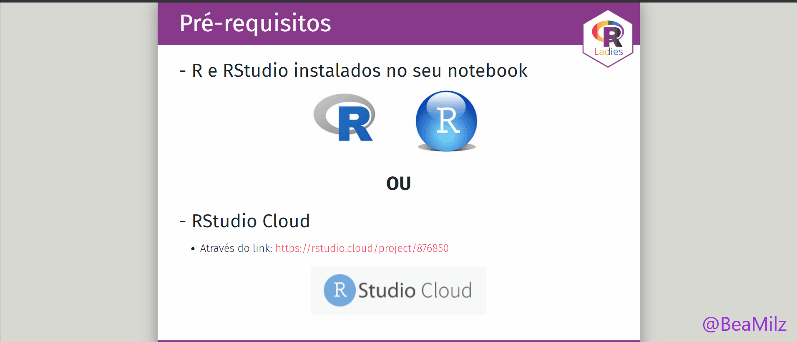
```


Importante: Quando aparecer na sua tela, clique em **"Save a permanent copy"**

---
class: center, middle

## Algoritmos


---
class:    

# O que é um algoritmo?

Um algoritmo é uma sequência finita de instruções.

--

O primeiro algoritmo foi desenvolvido no século XIX pela matemática e escritora inglesa Ada Lovelace.
 
```{r echo=FALSE, fig.align='center', out.width="40%"}
knitr::include_graphics("img/ada_lovelace.jpeg")
``` 

---
class:    


# O que é um algoritmo?

**Exemplo**

* Receita de bolo

```{r echo=FALSE, fig.align='center', out.width="90%"}
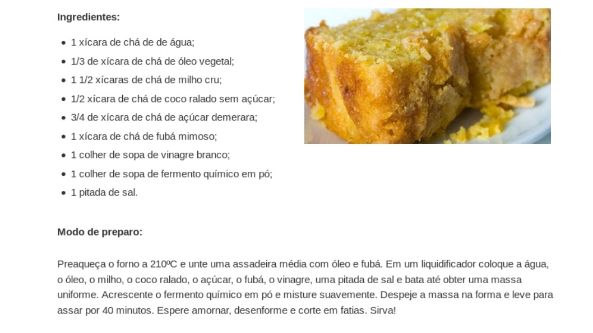
```

---
class:    

# O que é um algoritmo?

**Exemplo**

* [Como construir uma estante de livros](https://pt.wikihow.com/Construir-uma-Estante-de-Livros)

```{r echo=FALSE, fig.align='center', out.width="70%"}
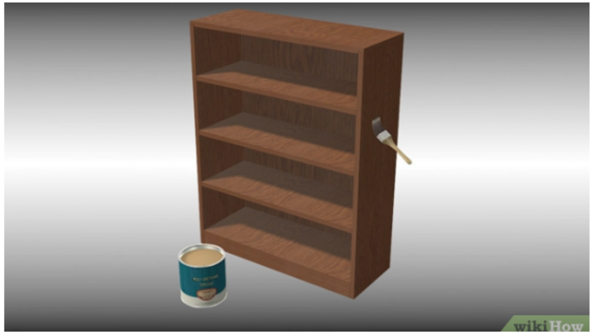
```

---
class:    

# O que é um algoritmo?

**Exemplo**

* [Como fazer um drone caseiro com arduino](https://www.palpitedigital.com/como-fazer-drone-caseiro-arduino/)

```{r echo=FALSE, fig.align='center', out.width="50%"}
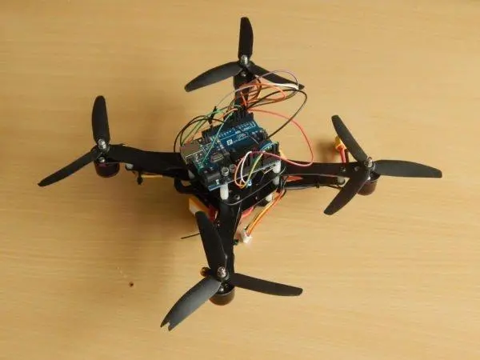
```


---
class:    

# O que é um algoritmo?

##**Sua vez...**

* Saindo de casa, pego o celular, abro um app e quero saber como chegar no SESC Paulista o mais breve possível. Poderia descrever qual(is) algoritmo(s) usamos?

```{r echo=FALSE, fig.align='center', out.width="70%"}
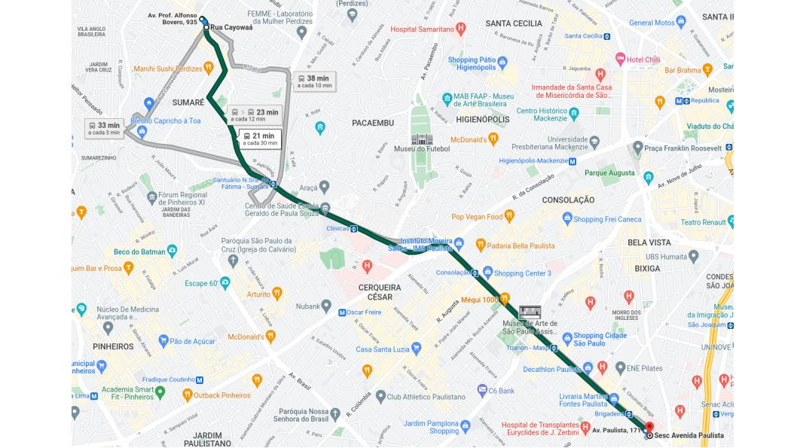
```

---
class: center, middle

## Programação

---
class:    


# O que é programar? 

Programar um computador é escrever instruções em qualquer **linguagem** que o computador entenda.

--

Essa sequência de instruções pode ser executada por um humano ou por um computador.

--

Então, **programação é a arte de fazer com que o computador execute uma sequência de instruções definidas.**

--

```{r}
print('Ola!')

```

---
class: center, middle

## R - uma visão geral

---
class:    

# O que é o R?
> "R é um ambiente de software livre para computação estatística e gráficos". (https://www.r-project.org/)

- **R** é um ambiente computacional e uma linguagem de programação que vem progressivamente se especializando em manipulação, análise e visualização gráfica de dados.


- Atualmente, é considerado um dos melhores ambientes computacionais para essa finalidade.


---
class:    

# O que é o R?

* O ambiente está disponível para diferentes sistemas operacionais: Unix/Linux, Mac e Windows. 

* Baseado na linguagem estatística S   

* 1ª versão de 1995 por Ross Ihaka e Robert Gentleman da Universidade de Auckland

```{r echo=FALSE, out.width="30%"}
knitr::include_graphics("img/Rlogo.png")
```

---
class:    


# O que é o R?
* Berço na Estatística

* Muito usado por cientistas de dados, estatísticos e pesquisadores

* Cada vez mais usado por jornalistas

* Mantida pela [R Development Core Team](https://cran.r-project.org/) 

* Pode ser usada para diversos fins

---
class:    

# Por que usar o R?

- É uma linguagem de programação para análise de dados

- É open source

- É uma linguagem interpretada

- Possui uma comunidade ativa de desenvolvedores

- É flexível, permitindo desenvolver funções e pacotes para facilitar o trabalho 

- É multiplataforma (Windows, Linux e Mac)

--

- É reprodutível!

--

- É compartilhável!


---
class:    

# O que é possível fazer com R?

* Análise de dados - Estatística, modelagem, etc.

* Visualização de dados

* Apresentações 

* Relatórios dinâmicos

* Escrever livros 

* Mineração de dados

* Muito mais ...


---
class:    


# Exemplo
**Gráfico elaborado com `R` - Material Particulado 10 - Dados CETESB - RPollution** 

```{r echo=FALSE, out.width="70%"}
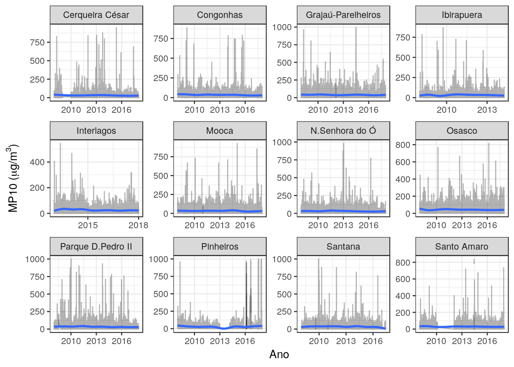 
```
Fonte: [Rpollution](https://www.rpollution.com/)

---
class:    

# Exemplo

**Frequência de Palavras - TESE Doutorado PROCAM/USP Ana Lucia Spinola** 

```{r echo=FALSE, out.width="70%"}
knitr::include_graphics("img/ana-lu-freq.png") 
```
Fonte: [Ana Lu Spinola](https://analuspi.github.io/Text-Mining/)
---
class:    


# Exemplo
**BIGRAM - TESE Doutorado PROCAM/USP Ana Lucia Spinola** 

```{r echo=FALSE, out.width="70%"}
knitr::include_graphics("img/bigram-ana-lu.png") 
```
Fonte: [Ana Lu Spinola](https://analuspi.github.io/Text-Mining/)

---
class: center, middle

## Introdução ao RStudio

---
class:    


# RStudio

<BR>
## É o IDE (*integrated development environment*) da Linguagem R, ou seja, o ambiente que utilizamos para editar e executar os códigos em R.


---
class:    


# RStudio
```{r echo=FALSE, out.width="100%"}
knitr::include_graphics("img/01-rstudio-script.png")
```
Fonte: [SW Carpentry](http://swcarpentry.github.io/r-novice-gapminder/01-rstudio-intro/index.html)


---
class:    

# RStudio
```{r echo=FALSE, out.width="100%"}
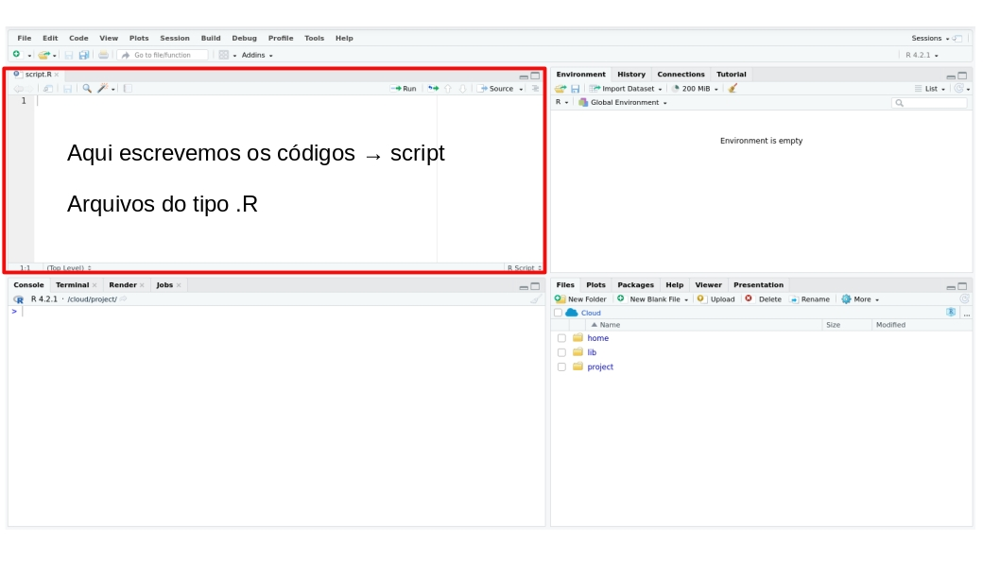
```


---
class:    

# RStudio
```{r echo=FALSE, out.width="100%"}
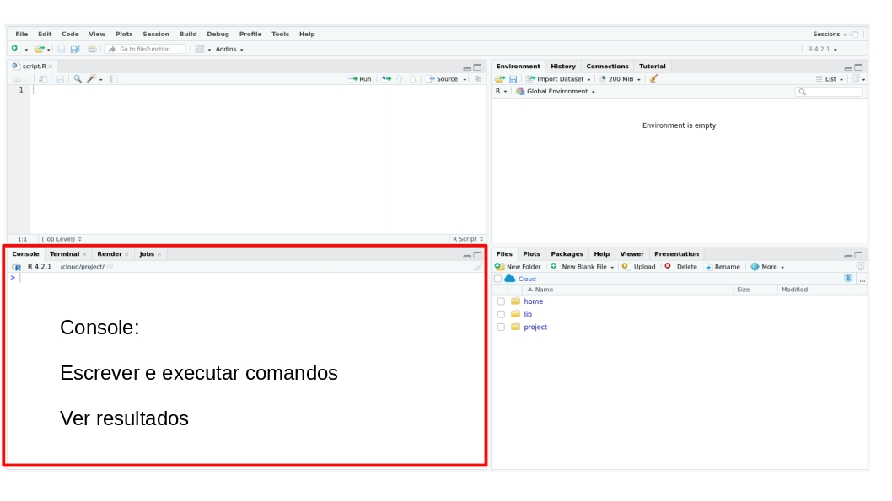
```


---
class:    

# RStudio
```{r echo=FALSE, out.width="100%"}
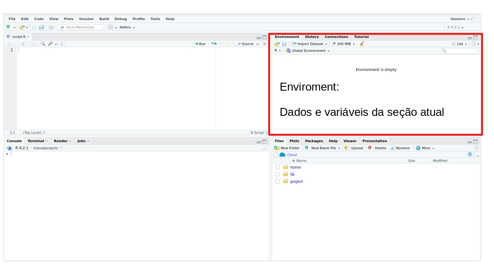
```


---
class:    

# RStudio
```{r echo=FALSE, out.width="100%"}
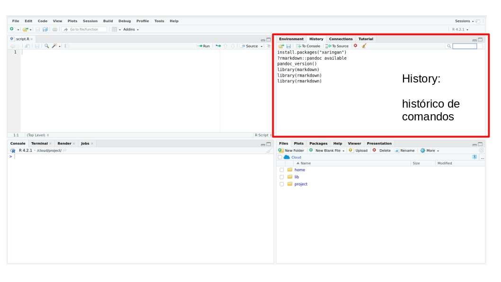
```


---
class:    

# RStudio
```{r echo=FALSE, out.width="100%"}
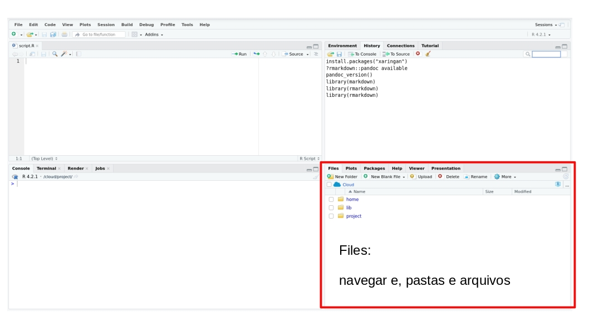
```


---
class:    

# RStudio
```{r echo=FALSE, out.width="100%"}
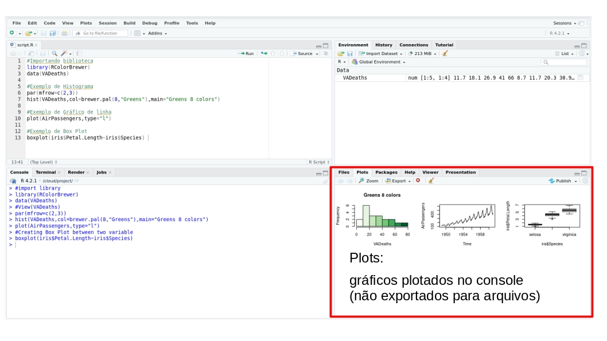
```


---
class:    

# RStudio
```{r echo=FALSE, out.width="100%"}
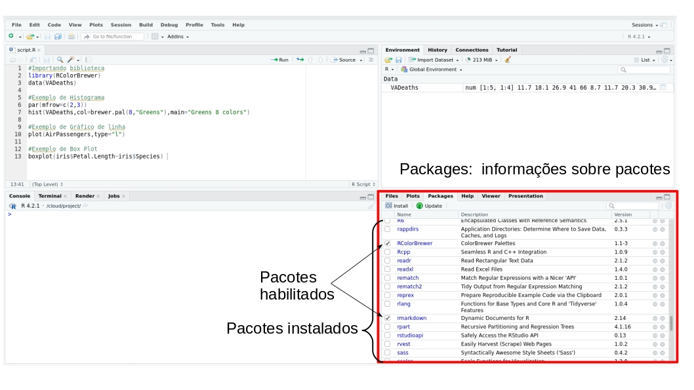
```


---
class:    

# RStudio

```{r echo=FALSE, out.width="100%"}
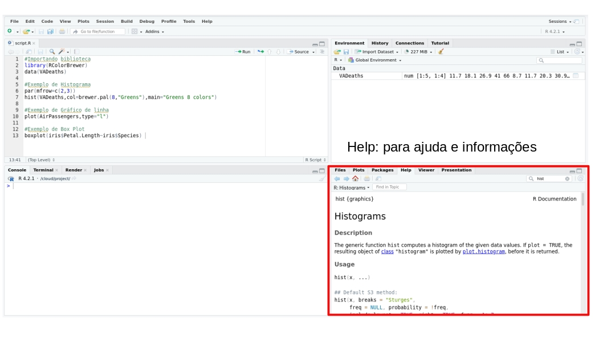
```

---
class:    

# RStudio

## Help

- Description: resumo geral
- Usage: mostra como a função dever ser utilizada e quais argumentos podem ser especificados
- Arguments: explica cada um dos argumentos
- Details: explica mais alguns detalhes
- Value: mostra o output da função (resultados)
- Note: traz notas adicionais sobre a função
- Authors: indica os(as) autores(as) da função
- References: referências para os métodos utilizados
- See also: traz funções relacionadas
- Examples: traz exemplos de uso da função


---
class:    

# Help!

- Pedir ajuda: **help**(nome_da_funcao) ou **?**nome_da_funcao.

```{r, eval=FALSE}
help(sum)
?sum
```

- Se a dúvida permanecer, procure no [Stack OverFlow](https://stackoverflow.com/) ou Google.
- E se ainda tiver dúvidas, pergunte para a comunidade (há grupos no Telegram e outras redes sociais).


---
class: center, middle

## Boas práticas iniciais para organizar seu projeto


Fonte: [SW Carpentry](http://swcarpentry.github.io/r-novice-gapminder/02-project-intro/index.html)

---
class: 

# Boas práticas 

#### Tratar dados como somente leitura

- Esse é provavelmente o objetivo mais importante da configuração de um projeto.

- Os dados geralmente consomem tempo e/ou são caros para coletar.

- Trabalhar com eles interativamente (por exemplo, no Excel), onde eles podem ser modificados, significa que você nunca tem certeza de onde os dados vieram, ou como eles foram modificados desde a coleta. 

- Portanto, é uma boa ideia tratar seus dados como “somente leitura”.

- Nunca sobrescrever os seus dados originais! Isso vale para a base e para variáveis.

- Ex: ter uma pasta "data_raw" (dados brutos), e "data" (dados já tratados). 

- Exemplo dos dados de orçamento da prefeitura: com código, fazer download dos dados brutos em uma pasta "data_raw". Tratar os dados, e a base "limpa" deve ser exportada para a pasta "data". Tudo isso deve ser realizado através de código! 


---
class: 

# Boas práticas 

#### Qualquer coisa gerada pelos seus scripts deve ser tratada como descartável


- Não salvar o workspace ao fechar!

- Ideal é que todos os seus resultados sejam possíveis de ser reproduzidos através do script. 


---
class: 

# Boas práticas 

#### Os nomes das suas variáveis devem fazer sentido

- Ao nomear suas variáveis, dê nomes que tenham significado para seres humanos. Pense que o código que você escreve hoje deve ser claro para você daqui 1 ano e também deve ser claro para algum(a) colega seu(ua).

- **Exemplo positivo**:

```{r include=TRUE, eval = FALSE }
lista_de_mercado <- c("chocolate", "pao", "café")

```

- **Exemplo negativo**:

```{r include=TRUE, eval = FALSE }
lista <- c("chocolate", "pao", "café")
```


---
class: 

# Boas práticas 

#### Comente bem o seu código

- É possível fazer comentários usando o símbolo '#'. É sempre bom explicar o que uma variável armazena, o que uma função faz, porque alguns parâmetros são passados para uma determinada função, qual é o objetivo de um trecho de código, etc.

```{r eval=FALSE, include=TRUE}
# Esse é um exemplo. O # é útil para escrever um comentário!

help(sum) # a função help é útil para pesquisar a documentação 
```

- Atalho útil para comentário: `Ctrl + Shift + C`

```{r, echo=FALSE, out.width="100%"}
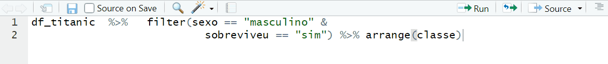
```


---
class: 

# Boas práticas

#### Evite linhas de código muito longas

- Usar linhas de código mais curtas ajuda na leitura do código.

- **Exemplo positivo**:  fica mais fácil de ler!
```{r include=FALSE}
df_titanic <- read_csv("data/titanic.csv")
```

```{r eval=FALSE, include=TRUE}
df_titanic  %>%
  filter(sexo == "masculino" & sobreviveu == "sim") %>%
  arrange(classe)
```

- **Exemplo para evitar:**  fica mais difícil de ler
```{r eval=FALSE, include=TRUE}
df_titanic  %>%   filter(sexo == "masculino" & sobreviveu == "sim") %>%   arrange(classe)
```

- Atalho útil para identação: `Ctrl + Shift + A`

```{r, echo=FALSE, out.width="100%"}
knitr::include_graphics("img/gif-atalho-identacao.gif")
```

Fonte: [SW Carpentry](http://swcarpentry.github.io/r-novice-gapminder/02-project-intro/index.html)


---
class: 

# Boas práticas 

#### Escreva um código organizado

- Por exemplo, adote um padrão no uso de minúsculas e maiúsculas, uma lógica única na organização de pastas e arquivos, pode ser adotada uma breve descrição (como comentário) indicando o que um determinado script faz.

- Exemplo: use snake_case (palavras em minúsculas, separados por um underscore) em todas as variáveis e funções do seu projeto.

- Dica útil: função `clean_names()` do pacote `janitor`.


```{r}
names(iris)
iris_clean <- janitor::clean_names(iris)
names(iris_clean)
```

---
class: 

# Boas práticas

#### Carregue todos os pacotes que irá usar sempre no início do arquivo

- Quando alguém abrir o seu código será fácil identificar quais são os pacotes que devem ser instalados e quais dependências podem existir.

- Exemplo:

```{r, eval=FALSE, include=TRUE}
# Pacotes utilizados no projeto
library(dplyr) # utilizada para manipulação dos dados
library(ggplot2) # utilizada para criar gráficos bonitos
library(magrittr) # possibilita usar o pipe %>% 
```

---
class: 

# Boas práticas

#### Evite referência de caminho que considere seu computador ou usuário

- Faça referência ao caminho do projeto.

- **Exemplo positivo**:

```{r include=TRUE, eval = FALSE }
df_titanic <- read_csv("data/titanic.csv")
```

- **Exemplo negativo**:

```{r include=TRUE, eval = FALSE }
df_titanic <- read_csv("C:\Users\beatr\Documents\GitHub\2020-R-Ladies-SP-Basico\data/titanic.csv")
```

---
class: 

# Boas práticas    

#### Antes de começar

- Ao realizar um projeto, sempre organizar os arquivos em uma **pasta** que conterá todos os arquivos de seu projeto. 

- Nomear novos arquivos com **nomes descritivos**


```{r echo=FALSE, out.width="90%"}
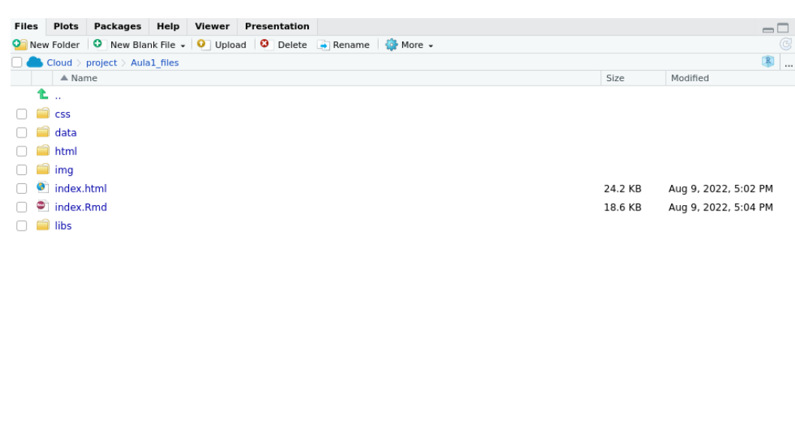 
```

---
class: 

# Boas práticas 

#### Adote um bom layout de projeto

- facilitará sua vida

- ajudará a garantir a integridade de seus dados

- facilitará o compartilhamento de seu código com outra pessoa (colega de laboratório, colaborador ou /orientador)

- permitirá que você facilmente faça o upload do seu código com a submissão do seu manuscrito

- tornará mais fácil recuperar o projeto depois de um intervalo


---
class:   

# Em casa...

## No seu computador instale `R` e `RStudio`

Link para obter a última versão do R: [https://www.r-project.org/](https://www.r-project.org/)

Link para obter a última versão do RStudio: [https://www.rstudio.com/products/rstudio/download/](https://www.rstudio.com/products/rstudio/download/)


```{r, echo=FALSE, out.width="50%"}
knitr::include_graphics("img/rlogos/rstudio-r.jpg")
```


---
class:   

# Em casa...

## Crie um projeto

- Abra o `RStudio` no seu computador

- Crie um novo projeto (file -> new project -> new directory -> new project)

- Escreva o nome do diretório (pasta) onde deseja manter seu projeto e clique no botão *“Create Project”*

- Crie um novo `R` script para escrever seus códigos (file -> new file -> `R` script)

```{r echo=FALSE, out.width="80%"}
knitr::include_graphics("img/gif-criar-projeto.gif") 
```


---
class:    

# Para aprender mais

- [Livro `R` for Data Science](https://r4ds.had.co.nz) <br></br>
- [Software Carpentry](https://software-carpentry.org/lessons/) <br></br>
- [Material do Curso-R](https://www.curso-r.com/material/) <br></br>
- [Repositório RLadies São Paulo](https://github.com/rladies/meetup-presentations_sao-paulo) <br></br>
- [R-Bloggers](https://www.r-bloggers.com) <br></br>

---
class:    

# Referências

- https://r4ds.had.co.nz

- https://www.curso-r.com/material/

- https://software-carpentry.org/lessons/

- https://beatrizmilz.github.io/talk/oficina_intro_r_ufabc_2018/

- https://bookdown.org/wevsena/curso_r_tce/curso_r_tce.html

- https://rafalab.github.io/dsbook/getting-started.html

- https://rstudio-pubs-static.s3.amazonaws.com/279878_c7634fb5fe9e40b7abc7c35aa724a2a0.html


---
class:center

# Agradecimentos

Beatriz Milz 
```{r echo=FALSE, out.width="20%"}
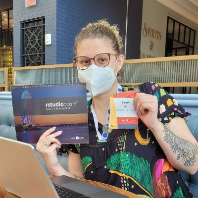 
```

Capítulo RLadies São Paulo
```{r echo=FALSE, out.width="20%"}
 
```

Apresentação feita com [RMarkdown](https://rmarkdown.rstudio.com/) e [Xaringan](https://github.com/yihui/xaringan), <br>
com o tema `metropolis` modificado por Bea Milz e Haydee Svab


---
class: middle

<center></center>
