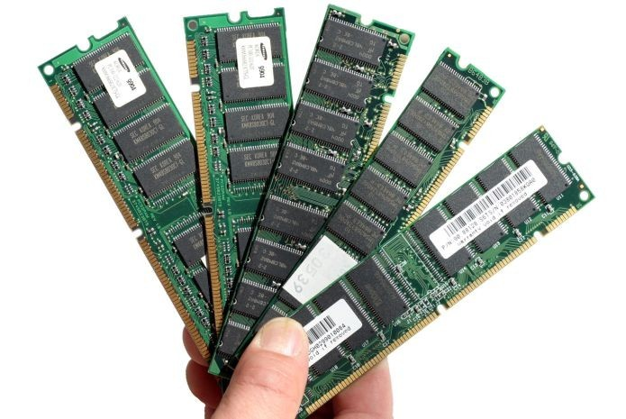
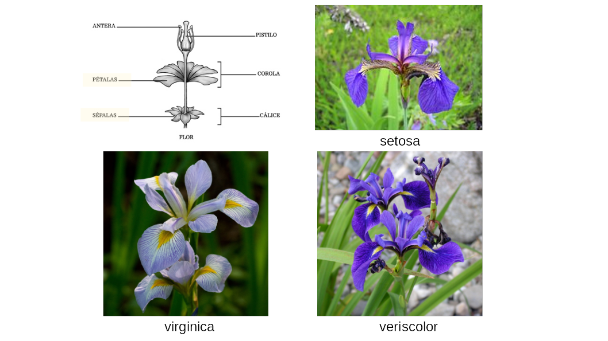
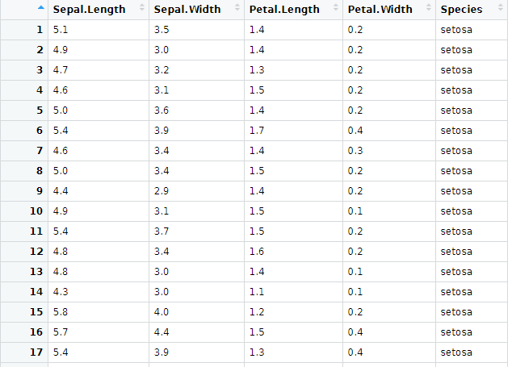

layout: true
  
<div class="my-footer"><span>


<a href="https://www.linkedin.com/in/hsvab/">LinkdIn</a> |
<a href="https://twitter.com/hsvab">Twitter</a> | 
<a href="https://www.instagram.com/haydeesvab/">Instagram</a> |
<a href="https://www.facebook.com/haydee.svab/">Facebook</a> |
<a href="https://github.com/hsvab">GitHub</a>


</span></div> 


---

class:

# Agenda do Curso

- Aula 1: Introdução ao R e ao RStudio

- **Aula 2: Primeiros passos com R e o pacote tidyverse**

- Aula 3: Abrindo e manipulando dados

- Aula 4: Tratando dados

- Aula 5: Estatísticas básicas

- Aula 6: Visualizando dados

- Aula 7: Comunicando resultados com Markdown


---
class:    

# Agenda de hoje

- Cálculos com R Básico

- Desafio #1

- Objetos no R - o que são e como atribuir valor

- Desafio #2

- Classes básicas ou atômicas do R

- Desafio #3

- Tipos de objetos no R

- Desafios #4

- Operadores relacionais e lógicos

- Desafio #5

- Pacotes e tidyverse

- Dicas finais para casa


---
class: center, middle

## Pré-requisitos

```{r setup, include=FALSE}
options(htmltools.dir.version = FALSE)

knitr::opts_chunk$set(fig.align = "center", message=FALSE, warning=FALSE)

library(tidyverse)

```

---
class: center

# Pré-requisitos

## - `R` e `RStudio` instalados no seu notebook 

```{r, echo=FALSE, out.width="25%"}
knitr::include_graphics("img/rlogos/rstudio-r.jpg")
```

## <center><b>OU</b></center> 

## - `RStudio` Cloud

```{r, echo=FALSE, out.width="30%"}
knitr::include_graphics("img/rstudiocloud.PNG")
```
Link da aula:
[https://bit.ly/rstudiocloud-curso-sesc](https://bit.ly/rstudiocloud-curso-sesc)

Não esqueça de fazer uma cópia do projeto


---

class: center, middle

## `R` Básico


---

class:    


# `R` como calculadora

- O `R` permite realizar muitas operações em seu console!

--

As tradicionais 4 operações aritméticas:


```{r}
7 + 9    # adição

9 - 2    # subtração

3 * 5    # multiplicação

18 / 9    # divisão
```


---
class:    

# `R` como calculadora

--

Que outras operações vocês imaginam?

--

```{r}
4 ^ 2    # potenciação

sqrt(64) # radiciação
```

--

```{r}
15 %/% 4  # parte inteira da divisão de 7 por 4

15 %% 4   # resto da divisão de 9 por 4

```

*Observação: a ordem matemática das operações continua valendo*


---

class:    

# Dica

##Seu primeiro "atalho" no R:

`CTRL + ENTER`: executa a linha selecionada no script.

<center></center> 


---
class:    

# Funções matemáticas

```{r}
sin(1)  # funções trigonométricas

log(1)  # logaritmo natural (base e)

log10(10) # logaritmo na base 10

exp(0.5) # e^(1/2)

```

Fonte: [SW Carpentry](http://swcarpentry.github.io/r-novice-gapminder/01-rstudio-intro/index.html)


---
class:    


# Desafio 1

Haydée quer contabilizar quantas pessoas participaram das suas aulas em 2021.
Ela anotou o número de pessoas que participaram em cada mês, como se segue:

1. Fevereiro, Outubro e Novembro - 20 pessoas cada
1. Abril e Agosto - 15 pessoas cada
1. Março, Maio e Julho - 30 pessoas cada 
1. Junho, Setembro e Dezembro - 25 pessoas cada  

Quantas pessoas participaram das suas aulas no período considerado? 

--

```{r}
3*20 + 15*2 + 30*3 + 25*3
```


---
class:    

# O que é um objeto?

É a representação do conjunto de carcterísticas individuais de alguma coisa.

- Ao se desenvolver um projeto, você irá trabalhar com diversos tipos de arquivos, além de informações que serão repetidas ao longo do script.

- Para reutilizar essas informações ao longo do script utilizamos **objetos**

- De forma simplificada, **um objeto retém e representa um valor ou uma expressão**.

```{r echo=FALSE, fig.align='center', out.width="30%"}

```


---

class:    

# Atribuindo valor a um objeto no R

- Para atribuir um valor a um objeto no R, utilizamos o operador **<-**  <br></br>

- Todas as declarações em `R` onde são criados objetos atribuindo-se valores a elas, têm a mesma forma:  

<center><b>nome_do_objeto <- valor</b></center>

--

- Exemplo 

```{r}
nome_municipio <- "Ipixuna do Pará"
```

--

```{r}
nome_municipio
```


---

class:    

# Dica

##Seu segundo "atalho" no R:


`ALT` + **`-`** gera o operador **<-**

<center></center> 

---

class:    


# Nomes de objetos

- Os nomes devem começar com uma letra. Podem conter letras, números, _ e .<br></br>

- Recomendação do autor do livro `R` For Data Science: **usar_snake_case**, ou seja, palavras escritas em minúsculo separadas pelo underscore (_).<br></br>

- O `R` é *case sensitive*, isto é, faz a diferenciação entre as letras minúsculas e maiúsculas. Portanto, um objeto chamado *teste* é diferente de uma outro objeto chamada *Teste*.


---

class:    

# Objetos e atribuição de valores

- Exemplos

```{r}
qtde_hab_municipio <- 62455
qtde_hab_municipio

pib.per.capita <- 8620.01
pib.per.capita

```

- Atenção para separador de milhar e de decimal: usa-se **.** como separador de decimal padrão.<br></br>


---
class:    

# Desafio 2

1) Crie objetos para os casos abaixo:
- Restaurante com valor Restaurante Italiano
- Conta a pagar com valor 50,75
- Saldo no VR com 75,00

--

2) Usando os objetos criados anteriormente, determine o saldo que restará no VR após pagar a conta.

```{r echo=FALSE, fig.align='center', out.width="50%"}

```


---
class:    

# Desafio 2 - Resposta

1) Crie objetos para os casos abaixo:

--

```{r}
restaurante <- "Restaurante Italiano"
restaurante
```

--

```{r}
conta <- 50.75
conta
```

--

```{r}
saldo_vr <- 75.00
saldo_vr
```

---
class:

# Desafio 2 - Resposta

2) Usando os objetos criados anteriormente, determine o saldo que restará no VR após pagar a conta.

--

```{r}

saldo_vr - conta

```


---
class:    


# Classes Básicas ou Atômicas do R

São os tipos básicos de dados que podem ser representados na linguagem R. É neles que guardamos as informações que necessitamos para um algoritmo.

- **Integer**: números inteiros <br></br>
- **Numeric**: números racionais <br></br>
- **Complex**: números complexos (raramente usados para Análise de Dados) <br></br>
- **Logical**: TRUE, FALSE ou NA <br></br>
- **Factor**: variavéis categóricas <br></br>
- **Character**: texto <br></br>


---
class:

# Exemplos: integer

Números inteiros

```{r}
50L # Um número inteiro pode ser representado acompanhado de um L
2022L
```


---

class:    

# Exemplos: numeric

Números racionais

```{r}
50
2022
5.75
```


---

class:    

# Exemplos: complex

Números complexos

```{r}
5 + 3i
```


---

class:    

# Exemplos: logical

Lógicos ou boleanos

```{r}
TRUE
FALSE
```

---

class:    

# Exemplos: factor

Variavéis categóricas (fatores)

```{r}
classificacao_municipio <- c("De pequeno porte",
                            "De médio porte",
                            "De grande porte")

fatores <- as.factor(classificacao_municipio)
```

--

```{r}
classificacao_municipio

fatores
```

A função as.factor() criou um objeto do tipo factor.

Na linha *Levels* aparecem os rótulos do fator.


---
class:    


# Exemplos: character

```{r}
"municipio"
"2022"
"Vai Censo!"
```


---
class:    

# Operações simples com strings

```{r}
municipio <- "Ipixuna do Pará"
#letras maiúsculas
toupper(municipio)
```

--

```{r}
#letras minúsculas
tolower(municipio)
```

--

```{r}
#número de caracteres
nchar(municipio)
```


---
class:    

# Função class

A função **class** mostra a classe de um objeto.

```{r}
nome_municipio <- "Ipixuna do Pará"
class(nome_municipio)
```

--

```{r}
ano_fundacao_inteiro <- 1991L
class(ano_fundacao_inteiro)
```

--

```{r}
ano_fundacao <- 1991
class(ano_fundacao)
```
Fonte: [Wikipedia](https://pt.wikipedia.org/wiki/Ipixuna_do_Pará)


---

class:    

# Conversão de classes

Podemos forçar um objeto a ser de uma classe específica com as funções:  
- as.character() <br></br>
- as.numeric() <br></br>
- as.integer() <br></br>
- as.logical() <br></br>

---
class:    


# Conversão de classes
** Exemplos de conversão de classes **

```{r}
vetor <- 0:9
vetor
```

--

```{r}
class(vetor)
```

--

```{r}
vetor_numeric <- as.numeric(vetor)
vetor_numeric
class(vetor_numeric)
```


---
class:    


# Desafio 3

Converta o objeto **conta** criado no Desafio 2 para character.
Agora cheque sua classe.
O que acontece com seu valor?
Como explica o que aconteceu?


---

class:    

# Desafio 3 - Resposta

Converta o objeto **conta** criado anteriormente para character. Agora cheque sua classe. O que acontece com seu valor? 

```{r}
conta
class(conta)
```

--

```{r}
conta <- as.character(conta)
class(conta)
```


---

class:    

# Desafio 3 - Resposta

Converta o objeto **conta** criado anteriormente para character. Agora cheque sua classe. O que acontece com seu valor? 

```{r}
as.character(conta)
class(conta)
```

--

```{r}
conta <-  as.character(conta)
class(conta)
```

---
class:    


# Tipos de objetos

Os tipos dos objetos são definidos a partir dos valores armazenados neles:

- **Vector**: armazena elementos de mesma classe. <br></br>   
- **Matrix**: vetores de duas dimensões que armazenam elementos de mesma classe. <br></br>
- **List**: tipo especial de vetor que aceita elementos de classes diferentes. <br></br>
- **Data.frame**: são tabelas de dados com linhas e colunas, como uma tabela do Excel. Como são listas, essas colunas podem ser de classes diferentes, mas as linhas de uma mesma coluna precisa conter elementos da mesma classe.

---
class:    


# Exemplo: Vector

A função c() cria um vetor.
```{r}
notas_estudantes <- c(5, 6.5, 10, 0.5, 2.75)
```

--

É possível realizar operações com vetores.

```{r}
notas_estudantes / 5   # objeto notas_estudantes dividido por 5
```

```{r}
multiplicador_presenca <- c(1, 1.1, 0.9, 1.2, 1.25)
notas_estudantes * multiplicador_presenca
```

--

Para checar se um objeto é um vetor:
```{r}
is.vector(notas_estudantes)
```

---
class:    


# Exemplo: Matrix

A função matrix() cria uma matriz.
```{r}
primeira_matriz <- matrix(1:8, nrow = 2, ncol = 4)
primeira_matriz
```

--

A função dim() retorna a dimensão do objeto (linha e coluna).
```{r}
dim(primeira_matriz)
```

--

Para checar se um objeto é uma matriz:
```{r}
is.matrix(primeira_matriz)
```


---
class:    


# Exemplo: List

A função list() cria uma lista.
```{r}
livros_R <- list("R para Data Science",
                 "Utilizando a Linguagem R",
                 c("Advanced R", "Hands-On Programming with R"))
```

--

Para checar se um objeto é uma lista:
```{r}
is.list(livros_R)
```

--

```{r}
livros_R_ingles <- c("Advanced R", "Hands-On Programming with R")
is.list(livros_R_ingles)
```


---
class:    

# Exemplo: Data.frame


```{r}
data(iris)

dataframe_flores <- iris

dataframe_flores
```


---
class:    

# Exemplo: Data.frame iris

```{r echo=FALSE, fig.align='center', out.width="170%"}

```


---
class:    

# Funções úteis 

##Para trabalhar com dataframes

- `head()`: mostra as primeiras 6 linhas.

- `tail()`: mostra as últimas 6 linhas.

- `names()`: mostra os nomes das colunas.

- `View()`: mostra o dataframe.

--

```{r}
head(dataframe_flores)
```


---
class:    


# Desafio 4

1) Quantas observações tem o dataframe_flores?<br></br>

2) Quais são as variáveis do dataframe_flores?<br></br>

3) Visualize o dataframe_flores.


---
class:    

# Desafio 4 - Resposta

1) Quantas observações tem o dataframe_flores?<br></br>
```{r}
tail(dataframe_flores)
```

2) Quais são as variáveis do dataframe_flores?

```{r}
names(dataframe_flores)
```


---
class:    

# Desafio 4 - Resposta

3) Visualize o dataframe_flores.
```{r eval=FALSE}
View(df)
```

```{r echo=FALSE, fig.align='center', out.width="75%"}

```


---
class:

# Operadores Relacionais
- Igual a: **==** <br></br> 
- Diferente de: **!=** <br></br>
- Maior que: **>** <br></br>
- Maior ou igual: **>=** <br></br>
- Menor que: **<** <br></br>
- Menor ou igual: **<=** <br></br>


---
class:    

# Exemplos de Operadores Relacionais

### Igual a: **==**
```{r}
TRUE == TRUE

TRUE == FALSE
```


---
class:    

# Exemplos de Operadores Relacionais

### Diferente de **!=**
```{r}
TRUE != TRUE

TRUE != FALSE
```


---
class:

# Exemplos de Operadores Relacionais

### Menor que: **<**
```{r}
3 < 5
```

--

### Menor ou igual que: **<=**
```{r}
3 <= 5

5 <= 5
```


---
class:

# Exemplos de Operadores Relacionais

### Maior que: **>**
```{r}
10 > 10
```

--

### Maior ou igual que: **>=**
```{r}
10 >= 10
```


---
class:


# Operadores Lógicos

- E: **&** <br></br>
Será verdadeiro se todas as condições forem verdadeiras (TRUE) ao mesmo tempo

- OU: **|**<br></br>
Será verdadeiro se pelo menos uma das condições for verdadeira (TRUE)

- Negação: **!** <br></br>


---
class:

# Exemplos de Operadores Lógicos

### E: **&**

```{r}
condicao1 <- 5

condicao1 >= 3 & condicao1 <=7
```

--

```{r}
condicao2 <- 2

condicao2 >= 3 & condicao2 <= 7
```


---
class:

# Exemplos de  Operadores Lógicos

### OU: **|**


```{r}
condicao2 <- 2

condicao2 >= 3 | condicao2 <=7
```

--

```{r}
condicao3 <- 1

condicao3 >= 3 | condicao3 == 0
```


---
class:

# Exemplos de Operadores Lógicos

### Negação: **!**

```{r}

condicao4 <- 6

!(condicao4 < 4)
```

---
class:


# NA

- **NA** representa um valor desconhecido. 

```{r}
NA > 5
```

--

```{r}
10 == NA
```

--

```{r}
NA + 5
```

--

```{r}
NA == NA
```

- **is.na()** é a função que testa se um objeto é NA.


---
class:    

# Índices 

- Indicam a posição do elemento no objeto.<br>

- Inicia-se a contagem do índice pela posição do primeiro elemento do objeto,
ou seja, pelo número 1.<br>

--

- **Vetores**: característica linear

```{r}
v <- c(10:25)

v[2]
```

--

- **Data Frames**: o primeiro número indica a linha (observação) e o segundo a coluna (variável).

```{r}
dataframe_flores[145, 2]
```

---
class:    


# Desafio 5

1) No dataframe_flores, testar se o valor de Petal.Lenght da 5ª observação é igual ao da 6ª observação. E se o valor de Petal.Lenght da 5ª observação é igual ao da 7ª observação.<br></br>


2) A 10ª observação tem Petal.Width maior ou menor que a seguinte (11ª)? 
E qual é a espécie da menor?


---
class:    

# Desafio 5 - Resposta

1) No dataframe_flores, testar se o valors de Petal.Lenght da 5ª observação é igual ao da 6ª observação. E se o valor de Petal.Lenght da 5ª observação é igual ao da 7ª observação.

```{r}
dataframe_flores[5,3] == dataframe_flores[6,3]
dataframe_flores[5,3] == dataframe_flores[7,3]
```


---
class:    

# Desafio 5 - Resposta

2) A 10ª observação tem Petal.Width maior ou menor que a seguinte (11ª)? 
E qual é a espécie da menor?

```{r}
dataframe_flores[10,4] < dataframe_flores[11,4] # Petal.Width da 10ª linha é menor que da 11ª

dataframe_flores[10,5]
```


---
class:    

# Para aprender mais & Referências:

- [Software Carpentry](https://software-carpentry.org/lessons/) <br></br>
- [Laboratório de Programação Orientada a Objetos - Parte 1](https://pt.coursera.org/learn/lab-poo-parte-1) <br></br>
- [Livro `R` for Data Science](https://r4ds.had.co.nz) <br></br>
- [Material do Curso-R](https://www.curso-r.com/material/) <br></br>
- [Repositório RLadies São Paulo](https://github.com/rladies/meetup-presentations_sao-paulo) <br></br>
- [R-Bloggers](https://www.r-bloggers.com) <br></br>


---
class:center

# Agradecimentos

Beatriz Milz 
```{r echo=FALSE, out.width="20%"}
knitr::include_graphics("img/bea-milz.jpg") 
```

Capítulo RLadies São Paulo
```{r echo=FALSE, out.width="20%"}
knitr::include_graphics("img/rlogos/r-ladies-sp.png") 
```

Apresentação feita com [RMarkdown](https://rmarkdown.rstudio.com/) e [Xaringan](https://github.com/yihui/xaringan), <br>
com o tema `metropolis` modificado por Bea Milz e Haydee Svab


---
class: middle

<center></center>
