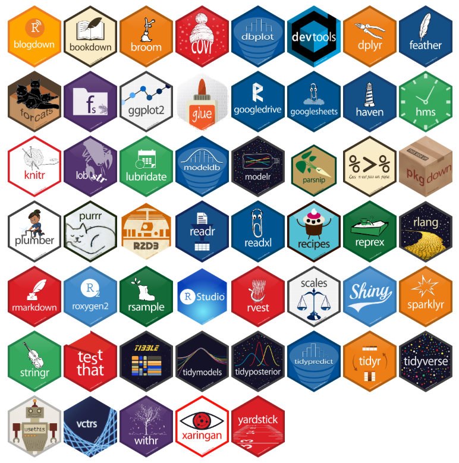
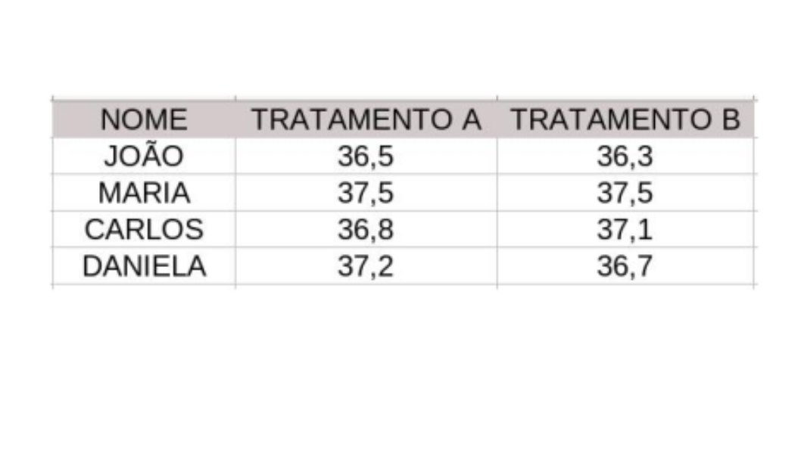
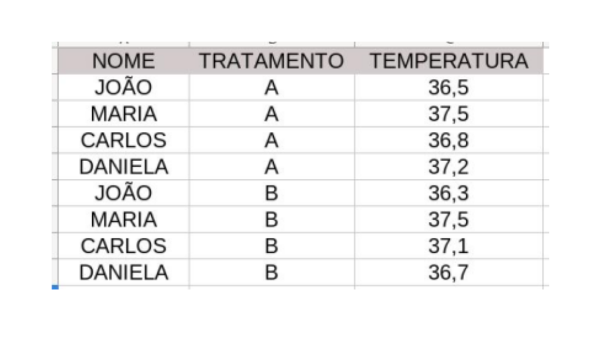
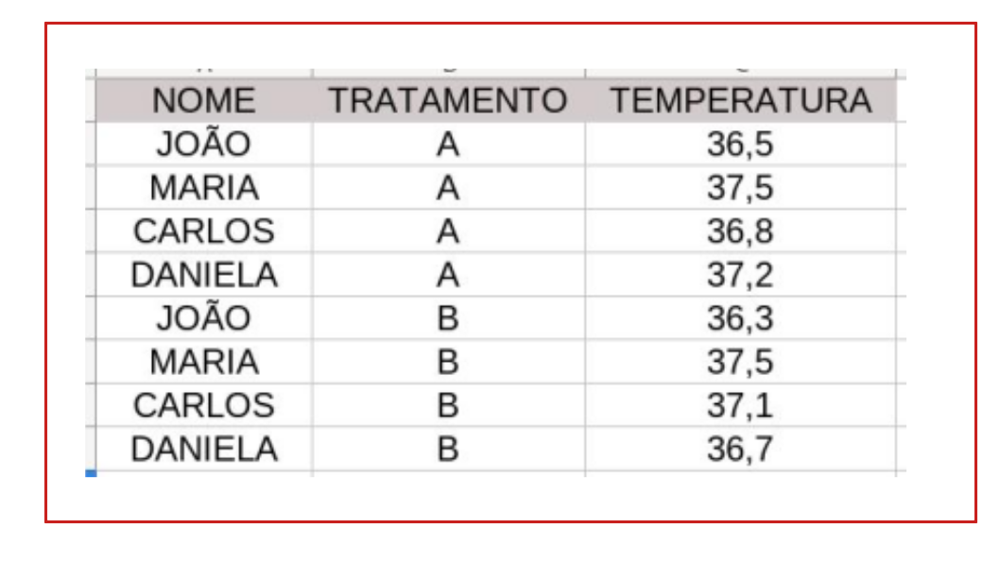
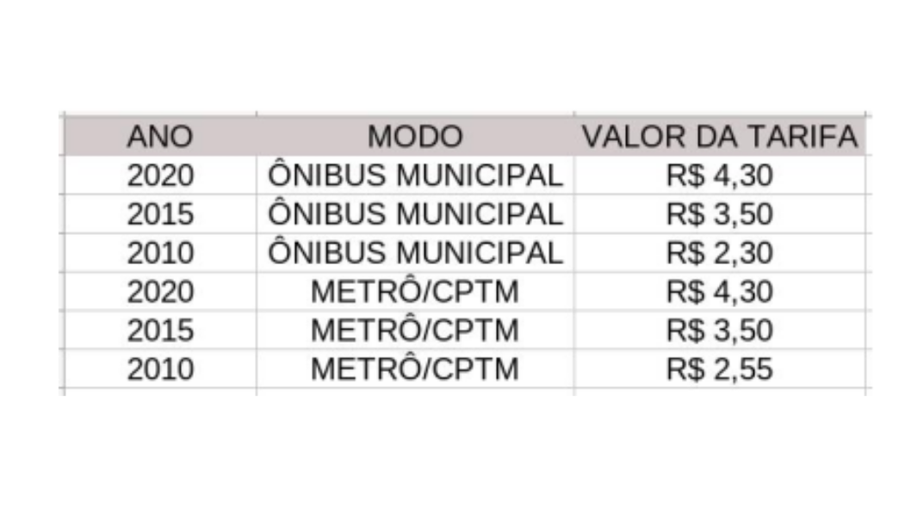
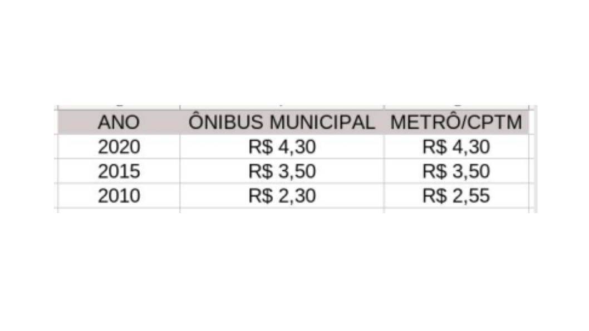
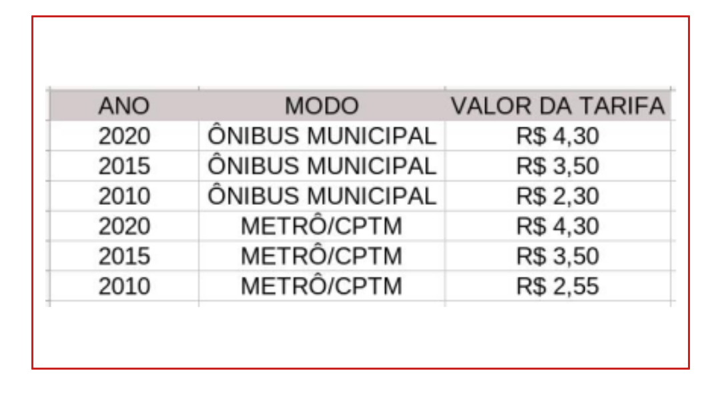

layout: true
  
<div class="my-footer"><span>


<a href="https://www.linkedin.com/in/hsvab/">LinkdIn</a> |
<a href="https://twitter.com/hsvab">Twitter</a> | 
<a href="https://www.instagram.com/haydeesvab/">Instagram</a> |
<a href="https://www.facebook.com/haydee.svab/">Facebook</a> |
<a href="https://github.com/hsvab">GitHub</a>


</span></div> 


---

class:

# Agenda do Curso

- Aula 1: Introdução ao R e ao RStudio

- Aula 2: Primeiros passos com R (R base)

- **Aula 3: Pacote tidyverse, abertura e manipulação de dados**

- Aula 4: Tratando dados

- Aula 5: Estatísticas básicas

- Aula 6: Visualizando dados

- Aula 7: Comunicando resultados com Markdown

---
class:    

# Agenda de hoje

- Pacotes e tidyverse + Desafio #1

- Leitura / importação de arquivos com R + Desafio #2

- Espiando os dados: View() e glimpse() + Desafio #3

- Manipulação de dados: filter() e select() + Desafios #4

- Manipulação de dados: rename() e mutate()

- Dicas finais para casa


---
class: center, middle

## Recapitulando...

```{r setup, include=FALSE}
options(htmltools.dir.version = FALSE)

knitr::opts_chunk$set(fig.align = "center", message=FALSE, warning=FALSE)

library(tidyverse)

```

---
class: center

# Pré-requisitos

## - `R` e `RStudio` instalados no seu notebook 

```{r, echo=FALSE, out.width="25%"}
knitr::include_graphics("img/rlogos/rstudio-r.jpg")
```

## <center><b>OU</b></center> 

## - `RStudio` Cloud

```{r, echo=FALSE, out.width="30%"}
knitr::include_graphics("img/rstudiocloud.PNG")
```
Link da aula:
[https://bit.ly/rstudiocloud-curso-sesc](https://bit.ly/rstudiocloud-curso-sesc)

Não esqueça de fazer uma cópia do projeto


---

class:    

# Atalhos

`CTRL + ENTER`: executa a linha selecionada no script

`ALT` + **`-`** gera o operador **<-**

<center></center> 


---

class: center, middle

## Pacotes no R


---
class:    

# Pacotes

**Pacotes** são coleções de funções, dados e documentação que estendem as capacidades do `R` básico.

Eles precisam ser instalados e carregados.

<center></center>


---
class:    

# Instalar Pacotes

- Via CRAN: install.packages("nome-do-pacote").

```{r, include=TRUE, eval = FALSE }
install.packages("tidyverse")
```

- Via Github: devtools::install_github("nome-do-repo/nome-do-pacote").

```{r, include=TRUE, eval = FALSE }
devtools::install_github("tidyverse/dplyr")
```

--
<BR>

**CRAN** = **C**omprehensive **R** **A**rchive **N**etwork (CRAN) é o maior
repositório de pacotes R (conta com 18506 pacotes  em 22/08/2022)


Relação de pacotes encontrados no CRAN por áreas de interesse: [CRAN Task View](https://cran.r-project.org/web/views/)

---
class:    

# Carregar pacotes

- library(nome-do-pacote)

```{r, eval=TRUE, message=FALSE}
library(tidyverse)
```


---
class:    

# Dicas sobre Pacotes

1. Você só precisa instalar o pacote uma vez, mas precisa carregá-lo sempre que começar uma nova sessão;

2. Para instalar o pacote use as aspas;  

3. Para carregar o pacote, **não** utilize as aspas.


---
class: center, middle


## Tidyverse


---
class:

# O Tidyverse

É uma coleção de pacotes `R` projetados para a ciência de dados.
Todos os pacotes compartilham uma mesma filosofia de desenvolvimento, 
sintaxe e estruturas de dados.

```{r echo=FALSE, fig.align='center', out.width="65%"}
knitr::include_graphics("img/tidyverse_packages.png")
```


---
class:

# Pacotes do Tidyverse

 .pull-left[
- **magrittr**: facilita a escrita e leitura do código <br></br>
- **readr**: leitura dos dados <br></br>
- **readxl**: leitura dos dados <br></br>
- **haven**: importar e exportar dados do SPSS, Stata e SAS <br></br>
- **tidyr**: arruma os dados <br></br>
- **dplyr**: manipulação de dados <br></br>
] 

 .pull-right[
- **ggplot2**: cria gráficos <br></br>
- **stringr**: trabalha com strings (textos) <br></br>
- **forcats**: trabalha com fatores <br></br>
- **lubridate**: trabalha com datas <br></br>
- **tibble**: trabalha com dataframes <br></br>
- **purrr**: ferramentas para programação funcional, trabalha com funções e vetores
]


---
class:


# O operador %>%, o Pipe

Imagine uma receita que tenha as instruções:
- junte os ingredientes;
- misture;
- leve ao forno.

--

Na forma usual do R (*R Base* ou *R Básico*), essas instruções provavelmente seriam assim:

**forno(misture(junte(ingredientes)))**

Dessa forma temos que pensar “de dentro para fora”, seguindo os parênteses.
Porém, o primeiro comando que lemos é forno, mas esta será a última operação a ser realizada.

--

O operador pipe muda a sintaxe para facilitar a leitura, que ficará assim:

**ingredientes %>% junte %>% misture %>% forno**

É mais intuitivo!

<!---
Formas de pensar:
um operador que efetua as operações à direita nos valores que estão à esquerda.
um operador que passa o que está à esquerda como argumento para a operação da direita.
-->

---

class:    

# Dica

##Seu terceiro "atalho" no R:


`CTRL` + `SHIFT` + `M` gera o operador pipe **%>%**

<center></center> 


---
class: 

# Formato tidy

É uma coleção de pacotes `R` projetados para a ciência de dados.
Todos os pacotes compartilham uma mesma filosofia de desenvolvimento, 
sintaxe e estruturas de dados.

```{r echo=FALSE, fig.align='center', out.width="85%"}
knitr::include_graphics("img/tidydata.png")
```

[Fonte: Data Science with R by Garrett Grolemund](http://garrettgman.github.io/tidying/)

---
class: 

# Formato tidy

**Vantagens:**

- facilita manipulação, modelagem, análise e visualização de dados
- padronização / interoperabilidade: outros formatos, inputs / outputs para softwares

--

**Problemas usuais:**

- cabeçalhos de colunas são valores e não os nomes das variáveis
- múltiplas variáveis armazenadas na mesma coluna
- variáveis armazenadas tanto em linhs como em colunas

--

**Boas práticas:**

- usar tidy data
- usar cabeçalho com nomes da variáveis (e que façam sentido para humanos)
- documentar (dicionário de dados - exemplo no [Portal de Dados Abertos](https://dados.gov.br/dataset/covid-19-vacinacao))


---
class:    

# Desafio 1

1) Qual das opções está no formato tidy?

 .pull-left[
```{r echo=FALSE, fig.align='center', out.width="120%"}

```
] 

 .pull-right[
```{r echo=FALSE, fig.align='center', out.width="120%"}

```
]


---
class:    

# Desafio 1 - resposta

1) Qual das opções está no formato tidy?

 .pull-left[
```{r echo=FALSE, fig.align='center', out.width="120%"}

```
] 

 .pull-right[
```{r echo=FALSE, fig.align='center', out.width="120%"}

```
]

---
class:    

# Desafio 1

2) Qual das opções está no formato tidy?

 .pull-left[
```{r echo=FALSE, fig.align='center', out.width="120%"}

```
] 

 .pull-right[
```{r echo=FALSE, fig.align='center', out.width="120%"}

```
]

---
class:    

# Desafio 1 - resposta

2) Qual das opções está no formato tidy?

 .pull-left[
```{r echo=FALSE, fig.align='center', out.width="120%"}

```
] 

 .pull-right[
```{r echo=FALSE, fig.align='center', out.width="120%"}

```
]


---

class: center, middle

## Leitura / importação de arquivos com R

---

# Leitura / importação de arquivos

Pacote **readr**: funções para ler arquivos texto

- read_csv - lê arquivo com campos separados por vírgula (padrão americano)
- read_csv2  - lê arquivo com campos separados por ponto-e-vírgula (padrão brasileiro)
- read_delim - lê arquivo com campos separados por delimitador que especificamos
- read_rds - lê arquivo do tipo rds (formato de arquivo que salva um único objeto do R)

--

Pacote **readxl**: função para ler arquivo Excel

- read_excel - lê arquivos do Excel (xls e xlsx)

--

Pacote **haven**: funções para ler outros softwares estatísticos

- read_sas - lê arquivos do SAS (.sas7bdat, .sas7bcat)
- read_spss - lê arquivos do SPSS (.sav, .zsav)
- read_stata - lê aqruivos do Stata (.dta)


---
class:    

# Desafio 2

No seu script R:

1) Carregar o pacote tidyverse

<BR>

<BR>


2) Importar o arquivo vacinas.csv para o objeto df_vacinas da pasta `data`


---
class:    

# Desafio 2 - resposta

No seu script R:

1) Carregar o pacote tidyverse

```{r, include=TRUE, eval = FALSE}
library(tidyverse)
```

--

2) Importar o arquivo vacinas.csv para o objeto df_vacinas_bruto da pasta `data`

```{r, include=TRUE, eval = FALSE}
df_vacinas <- read_csv("data/vacinas.csv")
```

*Observação: não esqueça das boas práticas!*


---

class: center, middle

## Espiando os dados: View() e glimpse()

---

# Espiando os dados

- Da aula passada, com R Básico:

```{r, include=TRUE, eval = FALSE }
View(df_vacinas)
```

--

- glimpse() fornece um "resumo" do dataframe

```{r, include=TRUE, eval = FALSE }
df_vacinas %>% glimpse()
```


---
class:    

# Desafio 3

No seu script R:

1) Use o View() e o glimpse() com o dataframe criado no Desafio 2.

<BR>

Qual é a diferença?


---

class: center, middle

## Manipulação de dados


---

# Manipulação de dados


## select()

Seleciona colunas (variáveis) da base de dados

--

## filter()

Seleciona linhas (observações) da base de dados


---

# Manipulação de dados


**Objetivo: Retornar nome e endereço dos postos de vacinação do bairro da Bela Vista que estão funcionando**


```{r, include=TRUE, eval = FALSE }
names(df_vacinas)
```

--

```{r, include=TRUE, eval = FALSE }
levels(as.factor(df_vacinas$status_fila))
```

--

```{r, include = TRUE, eval = FALSE }
df_postos_bela_vista <- df_vacinas %>%
  filter(distrito == "Bela Vista" & status_fila != "NÃO FUNCIONANDO") %>% 
  select(equipamento, endereco)

df_postos_bela_vista
```


---
class:    

# Desafio 4

No seu script R:

Retornar nome e endereço dos postos volantes, megapostos e postos em parque que não estão funcionando


---
class:    

# Desafio 4 - resposta

No seu script R:

Retornar nome e endereço dos postos volantes, megapostos e postos em parque que não estão funcionando

```{r, include=TRUE, eval = FALSE }
df_postos_funcionando <- df_vacinas %>%
  filter((tipo_posto == "PARQUES" |
           tipo_posto == "MEGAPOSTO" |
           tipo_posto == "POSTO VOLANTE") &
           (status_fila == "NÃO FUNCIONANDO")) %>% 
  select(equipamento, endereco)

df_postos_funcionando
```


---

# Manipulação de dados

## rename(novo_nome = nome_antigo)

Renomeia variáveis da base de dados


## mutate(variavel = expressão)

Cria ou modifica variáveis da base de dados


---

# Manipulação de dados

**Objetivo: Criar nova coluna "falta_az" indicando se há ou não a vacina aztrazeneca disponível.**

```{r, include=TRUE, eval = FALSE }
levels(as.factor(df_vacinas$astrazeneca))
```

--

```{r, include=TRUE, eval = FALSE }
df_vacinas <- df_vacinas %>%
  mutate(falta_az = case_when(
      astrazeneca == 0 ~ "postos_SEM_astrazeneca",
      astrazeneca == 1 ~ "postos_COM_astrazeneca"))
```

--

```{r, include=TRUE, eval = FALSE }
df_vacinas <- df_vacinas %>%
  rename (falta_astrazeneca = falta_az)
```


---

class: center, middle

## Em casa: revisar aulas 1, 2 e 3!


---
class:    

# Para aprender mais & Referências:

- [Pacote httr](https://www.rdocumentation.org/packages/httr) <br></br>
- [Pacote jsonlite](https://rdrr.io/cran/jsonlite/man/fromJSON.html) <br></br>
- [Pacote swirl](https://swirlstats.com/) <br></br>
- [Análise de Dados para as Ciências Sociais, por Jonathan Phillips](https://jonnyphillips.github.io/Ciencia_de_Dados/) <br></br>
- [Cheat sheets do RStudio](https://www.rstudio.com/resources/cheatsheets/) <br></br>
- [Livro `R` for Data Science](https://r4ds.had.co.nz) <br></br>
- [Repositório RLadies São Paulo](https://github.com/rladies/meetup-presentations_sao-paulo) <br></br>


---
class:center

# Agradecimentos

Ana Carolina Moreno
```{r echo=FALSE, out.width="20%"}
 
```

Capítulo RLadies São Paulo
```{r echo=FALSE, out.width="20%"}
knitr::include_graphics("img/rlogos/r-ladies-sp.png") 
```

Apresentação feita com [RMarkdown](https://rmarkdown.rstudio.com/) e [Xaringan](https://github.com/yihui/xaringan), <br>
com o tema `metropolis` modificado por Bea Milz e Haydee Svab


---
class: middle

<center></center>
