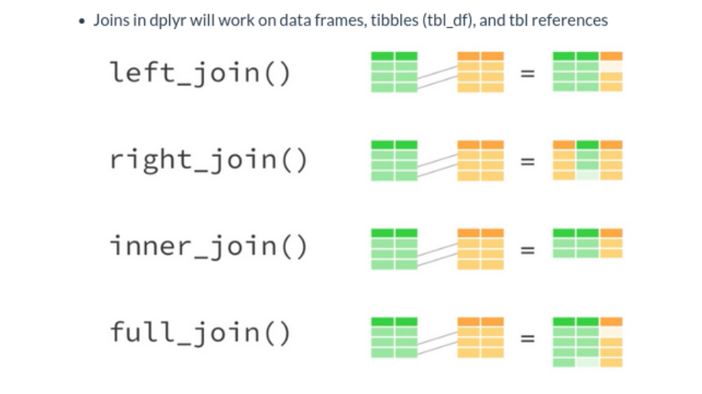
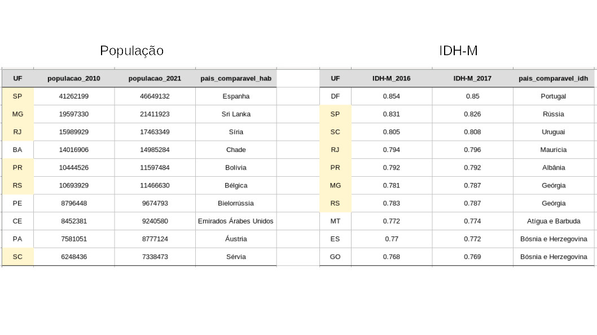
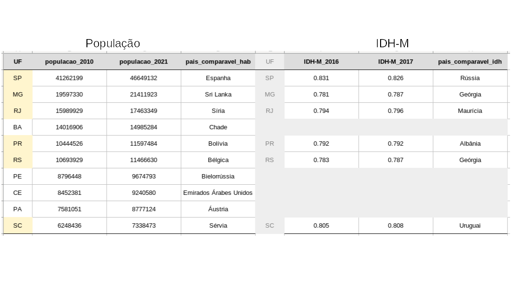
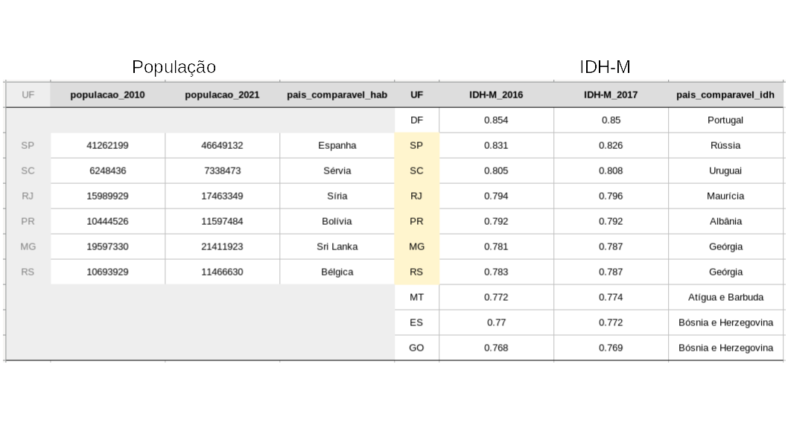
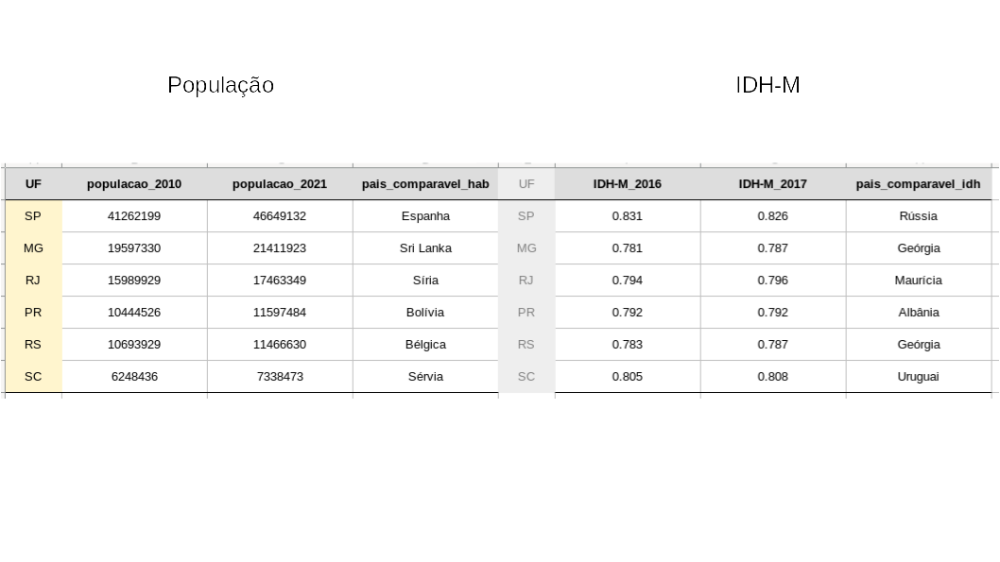
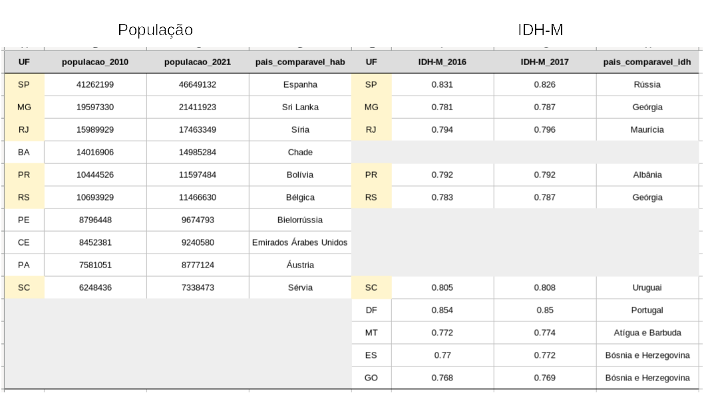

layout: true
  
<div class="my-footer"><span>


<a href="https://www.linkedin.com/in/hsvab/">LinkdIn</a> |
<a href="https://twitter.com/hsvab">Twitter</a> | 
<a href="https://www.instagram.com/haydeesvab/">Instagram</a> |
<a href="https://www.facebook.com/haydee.svab/">Facebook</a> |
<a href="https://github.com/hsvab">GitHub</a>


</span></div> 


---

class:

# Agenda do Curso

- Aula 1: Introdução ao R e ao RStudio

- Aula 2: Primeiros passos com R (R base)

- Aula 3: Pacote tidyverse, abertura e manipulação de dados

- **Aula 4: Tratando dados**

- Aula 5: Estatísticas básicas

- Aula 6: Visualizando dados

- Aula 7: Comunicando resultados com Markdown


---
class:    

# Agenda de hoje

- Breve recapitulação

- Manipulação de dados: if_else() e case_when()

- Manipulação de dados: rename() e mutate()

- Manipulação de dados: group_by() e summarise()

- Manipulação de dados: joins

- Desafio

- Dicas finais para casa


---
class: center, middle

## Breve recapitulação

```{r setup, include=FALSE}
options(htmltools.dir.version = FALSE)

knitr::opts_chunk$set(fig.align = "center", message=FALSE, warning=FALSE)

library(tidyverse)

```

---
class: center

# Recapitulando - Pré-requisitos

## - `R` e `RStudio` instalados no seu notebook 

```{r, echo=FALSE, out.width="25%"}
knitr::include_graphics("img/rlogos/rstudio-r.jpg")
```

## <center><b>OU</b></center> 

## - `RStudio` Cloud

```{r, echo=FALSE, out.width="30%"}
knitr::include_graphics("img/rstudiocloud.PNG")
```
Link da aula:
[https://bit.ly/rstudiocloud-curso-sesc](https://bit.ly/rstudiocloud-curso-sesc)

Não esqueça de fazer uma cópia do projeto


---

class:    

# Recapitulando - Atalhos

`CTRL + ENTER`: executa a linha selecionada no script

`ALT` + **`-`** gera o operador **<-**

`CTRL` + `SHIFT` + `M` gera o operador pipe **%>%**

<center></center> 


---

class:    

# Recapitulando - Pacotes

### Instalar

- Via CRAN: install.packages("nome-do-pacote").

```{r, include=TRUE, eval = FALSE }
install.packages("tidyverse")
```

- Via Github: devtools::install_github("nome-do-repo/nome-do-pacote").

```{r, include=TRUE, eval = FALSE }
devtools::install_github("tidyverse/dplyr")
```

### Carregar

```{r, include=TRUE, eval = FALSE }
library(tidyverse)
```

### Lembrete

- Você só precisa instalar o pacote uma vez, mas precisa carregá-lo sempre que começar uma nova sessão


---
class: 

# Recapitulando - Formato Tidy

É uma coleção de pacotes `R` projetados para a ciência de dados.
Todos os pacotes compartilham uma mesma filosofia de desenvolvimento, 
sintaxe e estruturas de dados.

```{r echo=FALSE, fig.align='center', out.width="85%"}
knitr::include_graphics("img/tidydata.png")
```

**Vantagens:**

- facilita manipulação, modelagem, análise e visualização de dados
- padronização / interoperabilidade: outros formatos, inputs / outputs para softwares


---

class: 

# Recapitulando -  Ler /importar


### Carregar pacote

Exemplo: carrega o pacote tidyverse

```{r, include=TRUE, eval = FALSE}
library(tidyverse)
```

### Importar arquivo 

Exemplo: importa vacinas.csv para o objeto df_vacinas da pasta `data`

```{r, include=TRUE, eval = FALSE}
df_vacinas <- read.csv("data/vacinas.csv")
```


---

class:

# Recapitulando - Ver / espiar

### Ver dataframe inteiro

Exemplo:

```{r, include=TRUE, eval = FALSE }
View(df_vacinas)
```

### Ver resumo do dataframe

Exemplo:

```{r, include=TRUE, eval = FALSE }
df_vacinas %>% glimpse()
```


---

class:

# Recapitulando - Selecionar / filtrar


### Selecionar colunas (variáveis)

**select()**


### Selecionar linhas (observações)

**filter()**

Exemplo: Retornar nome e endereço dos postos volantes, megapostos e postos em parque que não estão funcionando

```{r, include=TRUE, eval = FALSE }
df_postos_funcionando <- df_vacinas %>%
  filter((tipo_posto == "PARQUES" |
           tipo_posto == "MEGAPOSTO" |
           tipo_posto == "POSTO VOLANTE") &
           (status_fila == "NÃO FUNCIONANDO")) %>% 
  select(equipamento, endereco)
```

---

class:

# Recapitulando - Operadores Relacionais

- Igual a: **==** <br></br> 
- Diferente de: **!=** <br></br>
- Maior que: **>** <br></br>
- Maior ou igual: **>=** <br></br>
- Menor que: **<** <br></br>
- Menor ou igual: **<=** <br></br>


---
class: center, middle

## Manipulação de dados: condicionais


---

class:

# Manipulação de dados

### se e senão

***if_else ()***

    if_else(condição,
            valor se condição for verdadeira,
            valor se condição for falsa,
            valor no caso de NA)

Exemplo: 

```{r, include=TRUE, eval = FALSE }
df_vacinas_tratado <- df_vacinas %>%
  mutate(falta_coronavac = if_else(
    coronavac == 0,
    "postos_SEM_coronavac",
    "postos_COM_coronavac",
    missing = "sem informação"
  ))
           
```


---

class:

# Manipulação de dados

### no caso de

***case_when***

    case_when(condição1 ~ valor se condição1 for verdadeira,
              condição 2  ~ valor se condição2 for verdadeira,
              ...,
              TRUE ~ valor assumido para as demais condições) 

*É como se fossem vários if_elses juntos*

Exemplo: 

```{r, include=TRUE, eval = FALSE }
df_vacinas_tratado <- df_vacinas_tratado %>%
  mutate(falta_pfizer = case_when(
      pfizer == 0 ~ "postos_SEM_pfizer",
      pfizer == 1 ~ "postos_COM_pfizer",
      TRUE ~ "sem informação"))
  ))
           
```

---
class: center, middle

## Manipulação de dados: alterar nome e conteúdo de variáveis


---

class:

# Manipulação de dados

## Renomear variáveis da base de dados

***rename(novo_nome = nome_antigo)***

--

## Criar ou modificar variáveis da base de dados

***mutate(variavel = expressão)***


---

class:

# Manipulação de dados

Exemplo: Criar nova coluna "falta_az" indicando se há ou não a vacina aztrazeneca disponível

```{r, include=TRUE, eval = FALSE }
df_vacinas_tratado <- df_vacinas_tratado %>%
  mutate(falta_az = case_when(
    astrazeneca == 0 ~ "postos_SEM_astrazeneca",
    astrazeneca == 1 ~ "postos_COM_astrazeneca",
    TRUE ~ "sem informação"))
```

--

O nome falta_az ficou meio obscuro, vamos renomear para falta_astrazeneca:

```{r, include=TRUE, eval = FALSE }
df_vacinas <- df_vacinas %>%
  rename (falta_astrazeneca = falta_az)
```


---

class:

# Manipulação de dados

## Agrupar colunas (variáveis) de uma base de dados

***group_by()***

--

## Sumarizar colunas da base de dados, ou seja, resume os valores das colunas em um só valor.

***summarise()***

Pode ser a média, mediana, mínimo, máximo, etc.

--

**Atenção: a função "group_by" SEMPRE precisa de um acompanhamento, como a função summarise**


---

class:

# Manipulação de dados

Exemplo: Calcular o total de postos por distrito que estão funcionando

--

Primeiramente, vou definir o dataframe (df_postos_por_distrito) apenas com
postos que estão funcionando e, na sequência vou criar uma variável (flag) que
sinaliza se a observação corresponde a um equipamento existente (excluindo os 
campos nulos).

--

```{r, include=TRUE, eval = FALSE }

df_postos_por_distrito <- df_vacinas_tratado %>%
  filter(status_fila != "NÃO FUNCIONANDO") %>%
  mutate(equipamento_existe = case_when(
    !is.na(equipamento) ~ 1,
    T ~ 0))

```
--

Aí faço a soma, agrupando por distrito :)

--

```{r, include=TRUE, eval = FALSE }

df_postos_por_distrito <- df_postos_por_distrito %>%
  group_by(distrito) %>%
  summarise(qtde_postos_total_por_distrito = sum(equipamento_existe))  

```

---

class: center, middle

## Manipulação de dados: joins


---

class:

# Manipulação de dados

## Join

Os vários tipos de `Join` são usados para unir, de diversas formas, dataframes.

--

```{r, echo=FALSE, out.width="70%"}

```

*Dica: para ajudar a compreender as operações de join, vale lembrar daquelas operações com conjuntos: união, intersecção, etc.*


---

class:

# Manipulação de dados

## Join

Exemplo: Dados 2 dataframes, um com top 10 estados brasileiros mais populosos e 
outro com top 10 estados brasileiros em IDH-M (dados de 2016 e 2017)

```{r, echo=FALSE, out.width="110%"}
knitr::include_graphics("img/tabelas.png")
```


---

class:

# Manipulação de dados

## Join

É preciso definir qual é a variável (chave, key) que será usada para unir os dataframes.

No nosso caso, será `UF`.


```{r, echo=FALSE, out.width="110%"}

```

---

class:

# Manipulação de dados

## Join

Preparação para nossos exemplos:

```{r, include=TRUE, eval = FALSE }

# carrega pacote tidyverse
library(tidyverse)

# configura diretoório de trabalho
setwd("/cloud/project/Aula4_files")

# lê o csv com dados de populacao
df_populacao <- read.csv("data/populacao.csv")

# lê o csv com dados de idh-m
df_idhm <- read.csv("data/idhm.csv")

```


---

class:

# Manipulação de dados

## left_join

Ao unir 2 dataframes com left_join, o dataframe da esquerda permanece íntegro, e são acrescentadas as colunas do dataframe da direita que derem "match" a partir da variável de compatibilização (***by***).

```{r, echo=FALSE, out.width="90%"}

```


---

class:

# Manipulação de dados

## left_join

```{r, include=TRUE, eval = FALSE }
# Acrescenta dados de IDH dos top 10 estados aos top 10 estados mais populosos
df_resultante_left <- df_populacao %>% 
  left_join(df_idhm, by = "UF")
```


---

class:

# Manipulação de dados

## right_join

Ao unir 2 dataframes com right_join, o dataframe da direita permanece íntegro, e são acrescentadas as colunas do dataframe da esquerda que derem "match" a partir da variável de compatibilização (***by***).

```{r, echo=FALSE, out.width="90%"}

```


---

class:

# Manipulação de dados

## right_join

```{r, include=TRUE, eval = FALSE }
# Acrescenta dados de população dos top 10 estados aos top 10 estados com melhor idh
df_resultante_right <- df_populacao %>% 
  right_join(df_idhm, by = "UF")
```


---

class:

# Manipulação de dados

## inner_join

Ao unir 2 dataframes com inner_join, as observações que permanecem, de ambos os 
dataframes, são aquelas que têm correspondência a partir da variável de compatibilização (***by***).

```{r, echo=FALSE, out.width="90%"}

```


---

class:

# Manipulação de dados

## inner_join

```{r, include=TRUE, eval = FALSE }
# Gera dataframe apenas dos estados que estão entre os top 10 mais populosos e 
# também estão entre os top 10 com melhor IDH
df_resultante_inner <- df_populacao %>% 
  inner_join(df_idhm, by = "UF")
```


---

class:

# Manipulação de dados

## full_join

Todas as observações, de ambos os dataframes, são preservadas, sendo que aquelas
que têm correspondência a partir da variável de compatibilização (***by***) são pareadas.

```{r, echo=FALSE, out.width="90%"}

```


---

class:

# Manipulação de dados

## full_join

```{r, include=TRUE, eval = FALSE }
# Gera dataframe de todos os estados, bastando estar entre os top 10 de população
# ou de idh. Caso não haja dados correspondentes, campos ficam com NA
df_resultante_full <- df_populacao %>% 
  full_join(df_idhm, by = "UF")
```


---
class:    

# Desafio

No seu script R:

1) Crie nova coluna "falta_janssen" indicando se há ou não a vacina janssen disponível

2) Calcular o total de postos por distrito com janssen

3) Calcular a porcentagem de postos com janssen, por distrito


---
class:    

# Desafio - resposta 1)

No seu script R:

1) Crie nova coluna "falta_janssen" indicando se há ou não a vacina janssen disponível

```{r, include=TRUE, eval = FALSE }
df_vacinas_tratado <- df_vacinas_tratado %>%
  mutate(falta_janssen = case_when(
    janssen == 0 ~ "postos_SEM_janssen",
    janssen == 1 ~ "postos_COM_janssen",
    T ~ "sem informação"))
```

---
class:    

# Desafio - resposta 2)

No seu script R:

2) Calcular o total de postos por distrito com janssen

```{r, include=TRUE, eval = FALSE }

# Determina o total de postos com janssen por distrito
df_postos_por_distrito <- df_vacinas_tratado %>%
  filter(status_fila != "NÃO FUNCIONANDO") %>%
  mutate(equipamento_existe = case_when(
    !is.na(equipamento) ~ 1,
    T ~ 0)) %>% 
  # agrupa por distritos e por falta_janssen
  group_by(distrito, falta_janssen) %>%
  # e faz a soma
  summarise(qtde_postos_com_janssen_por_distrito = sum(equipamento_existe)) %>% 
  # filtra apenas os postos que têm janssen
  filter(falta_janssen == "postos_COM_janssen")

```


---
class:    

# Desafio - resposta 3)

3) Calcular a porcentagem de postos com janssen, por distrito

```{r, include=TRUE, eval = FALSE }
df_postos_com_janssen_por_distrito <- df_postos_com_janssen_por_distrito  %>% 
  right_join(df_postos_por_distrito, by = "distrito") %>% 
  mutate(porcentagem_janssen = (qtde_postos_com_janssen_por_distrito/qtde_postos_total_por_distrito)*100,
         porcentagem_janssen = if_else(is.na(porcentagem_janssen), 0, porcentagem_janssen)) %>%
  select(distrito, porcentagem_janssen)
```


---
class:    

# Curiosidade para casa!

Função que raspa os dados do site "De Olho na Fila" da Prefeitura de São Paulo


```{r, include=TRUE, eval = FALSE }
deolhonafila <- function(){
  
  # Define url do site que será raspado
  url <- "https://deolhonafila.prefeitura.sp.gov.br/processadores/dados.php"

  # Usa a função POST (que faz requisições) do pacote httr que precisa passar como
  # parâmetros, ao menos: endereço web a ser raspado (url), o que será raspado (body)
  # e como é a forma do dado que envio para a página (encode)
  httr::POST(url, body = list(dados = "dados"), encode = "form")  %>%
    
    # extrai o conteúdo da requisição
    httr::content("text")  %>%
    
    # função que transforma dados organizados como JSON para objetos R
    jsonlite::fromJSON()
}
```

Autoria: José de Jesus Filho, disponível em: [https://github.com/jjesusfilho](https://github.com/jjesusfilho)


---
class:    

# Para aprender mais & Referências:

- [Pacote httr](https://www.rdocumentation.org/packages/httr) <br></br>
- [Pacote jsonlite](https://rdrr.io/cran/jsonlite/man/fromJSON.html) <br></br>
- [Pacote swirl](https://swirlstats.com/) <br></br>
- [Análise de Dados para as Ciências Sociais, por Jonathan Phillips](https://jonnyphillips.github.io/Ciencia_de_Dados/) <br></br>
- [Cheat sheets do RStudio](https://www.rstudio.com/resources/cheatsheets/) <br></br>
- [Livro `R` for Data Science](https://r4ds.had.co.nz) <br></br>
- [Repositório RLadies São Paulo](https://github.com/rladies/meetup-presentations_sao-paulo) <br></br>


---
class:center

# Agradecimentos

Ana Carolina Moreno
```{r echo=FALSE, out.width="20%"}
 
```

Capítulo RLadies São Paulo
```{r echo=FALSE, out.width="20%"}
 
```

Apresentação feita com [RMarkdown](https://rmarkdown.rstudio.com/) e [Xaringan](https://github.com/yihui/xaringan), <br>
com o tema `metropolis` modificado por Bea Milz e Haydee Svab


---
class: middle

<center></center>
