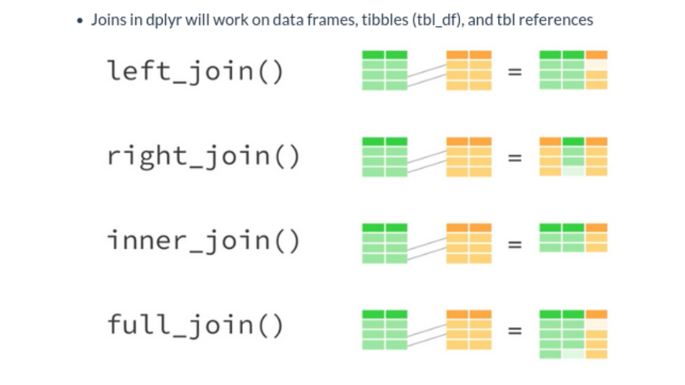
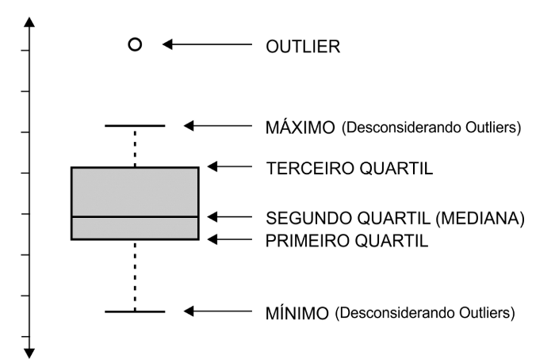
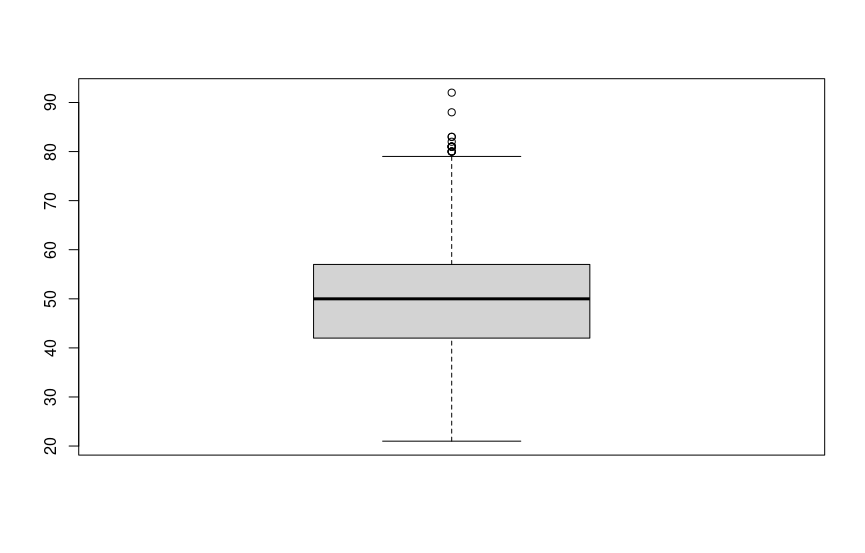

layout: true
  
<div class="my-footer"><span>


<a href="https://www.linkedin.com/in/hsvab/">LinkdIn</a> |
<a href="https://twitter.com/hsvab">Twitter</a> | 
<a href="https://www.instagram.com/haydeesvab/">Instagram</a> |
<a href="https://www.facebook.com/haydee.svab/">Facebook</a> |
<a href="https://github.com/hsvab">GitHub</a>


</span></div> 


---

class:

# Agenda do Curso

- Aula 1: Introdução ao R e ao RStudio

- Aula 2: Primeiros passos com R (R base)

- Aula 3: Pacote tidyverse, abertura e manipulação de dados

- Aula 4: Tratando dados

- **Aula 5: Estatísticas básicas**

- Aula 6: Visualizando dados

- Aula 7: Comunicando resultados com Markdown


---
class:    

# Agenda de hoje

- Breve recapitulação

- Intervalo dos dados: mínimo e máximo

- Medidas de posição: média e mediana

- Medidas de dispersão: variância e desvio padrão

- Identificando outliers

- Desafio

- Dicas finais para casa


---
class: center, middle

## Breve recapitulação

```{r setup, include=FALSE}
options(htmltools.dir.version = FALSE)

knitr::opts_chunk$set(fig.align = "center", message=FALSE, warning=FALSE)

library(tidyverse)

```

---
class: center

# Recapitulando - Pré-requisitos

## - `R` e `RStudio` instalados no seu notebook 

```{r, echo=FALSE, out.width="25%"}
knitr::include_graphics("img/rlogos/rstudio-r.jpg")
```

## <center><b>OU</b></center> 

## - `RStudio` Cloud

```{r, echo=FALSE, out.width="30%"}
knitr::include_graphics("img/rstudiocloud.PNG")
```
Link da aula:
[https://bit.ly/rstudiocloud-curso-sesc](https://bit.ly/rstudiocloud-curso-sesc)

Não esqueça de fazer uma cópia do projeto


---

class:    

# Recapitulando - Atalhos

`CTRL + ENTER`: executa a linha selecionada no script

`ALT` + **`-`** gera o operador **<-**

`CTRL` + `SHIFT` + `M` gera o operador pipe **%>%**

<center></center> 


---

class:    

# Recapitulando - Pacotes

### Instalar

- Via CRAN: install.packages("nome-do-pacote").

```{r, include=TRUE, eval = FALSE }
install.packages("tidyverse")
```

- Via Github: devtools::install_github("nome-do-repo/nome-do-pacote").

```{r, include=TRUE, eval = FALSE }
devtools::install_github("tidyverse/dplyr")
```

### Carregar

```{r, include=TRUE, eval = FALSE }
library(tidyverse)
```

### Lembrete

- Você só precisa instalar o pacote uma vez, mas precisa carregá-lo sempre que começar uma nova sessão


---

class:

# Recapitulando - Manipulação de dados

### se e senão

***if_else ()***

    if_else(condição,
            valor se condição for verdadeira,
            valor se condição for falsa,
            valor no caso de NA)

### no caso de

***case_when()***

    case_when(condição1 ~ valor se condição1 for verdadeira,
              condição 2  ~ valor se condição2 for verdadeira,
              ...,
              TRUE ~ valor assumido para as demais condições) 


---

class:

# Recapitulando - Manipulação de dados

### Selecionar colunas (variáveis)

    select(variável_1, variável_2 ...)

### Selecionar linhas (observações)

    filter(condição de comparação para seleção das obsevações desejadas)


---

class:

# Recapitulando - Manipulação de dados

### Renomear variáveis da base de dados

    rename(novo_nome = nome_antigo)

### Criar ou modificar variáveis da base de dados

    mutate(variável = expressão)


---

class:

# Recapitulando - Manipulação de dados

### Importar arquivo com fread

Exemplo: importar, da pasta `data`, dados de perfil e de bens de candidaturas 2022


```{r, include=TRUE, eval = FALSE}

# Arquivo com todas informações de candidatos(as) de São Paulo
info_bens_candidatos_sp <- data.table::fread(file = "./data/consulta_cand_2022_SP.csv",
                                                    sep = ";",
                                                    dec = ",",
                                                    encoding = "Latin-1")


# Arquivo com todas informações de bens candidatos(as) de São Paulo
info_candidatos_total <- data.table::fread(file = "./data/bem_candidato_2022_SP.csv",
                                                    sep = ";",
                                                    dec = ",",
                                                    encoding = "Latin-1")
```

Fonte: [Portal Dados Abertos do TSE](https://dadosabertos.tse.jus.br/dataset/candidatos-2022)


---

class:

# Recapitulando - Manipulação de dados

## Agrupar colunas (variáveis) de uma base de dados

    group_by()

## Sumarizar colunas da base de dados, ou seja, resume os valores das colunas em um só valor.

    summarise()


**Atenção: a função "group_by" SEMPRE precisa de um acompanhamento, como a função summarise**


---

class:

# Recapitulando - Manipulação de dados

### Agrupar e sumarizar variáveis

Exemplo: determinar o total de bens por candidato(a)

```{r, include=TRUE, eval = FALSE}

df_total_bens_por_candidato <- info_bens_candidatos_sp %>%
  group_by(SQ_CANDIDATO) %>% 
  summarise(VR_BEM_CANDIDATO = sum(VR_BEM_CANDIDATO))

```


---

class:

# Recapitulando - Manipulação de dados

## Joins

Os vários tipos de `Join` são usados para unir, de diversas formas, dataframes.

```{r, echo=FALSE, out.width="70%"}

```

*Dica: para ajudar a compreender as operações de join, vale lembrar daquelas operações com conjuntos: união, intersecção, etc.*


---

class:

# Recapitulando - Manipulação de dados

## Joins

Exemplo: Desejo juntar informação de bens às de candidatos(as).

--

Ou seja, quero fazer um left_join entre o dataframe df_total_bens_por_candidato e o info_candidatos_sp, onde a chave comum é a variável é SQ_CANDIDATO (número sequencial do/a candidato/a).

--

```{r, include=TRUE, eval = FALSE }
df_candidatos_com_bens <- info_candidatos_sp %>%
  left_join(df_total_bens_por_candidato, by = "SQ_CANDIDATO")
```


---
class: center, middle

## Intervalo dos dados

---

class:

# Intervalo dos dados

## valor mínimo

    min()

## valor máximo

    max()

Exemplo: Cálculo dos valores mínimo e máximo dos bens declarados

--

```{r, include=TRUE, eval = FALSE }
resumo_sp <- df_candidatos_com_bens %>% 
  summarise(minimo = min(VR_BEM_CANDIDATO, na.rm = TRUE),
            maximo = max(VR_BEM_CANDIDATO, na.rm = TRUE)) %>% 
  mutate(UF = "SP")
```


---
class: center, middle

## Medidas de posição


---

class:

# Medidas de posição

## média

É definida somando-se todos os números do conjunto de dados e então dividindo o resultado pelo número de valores do conjunto.

    mean()

## mediana

É o valor do meio quando o conjunto de dados está ordenado do menor para o maior (se for um número par de dados, corresponde à média dos 2 elementos do meio). 

    median()
    
*Observação: a vantagem da mediana é que ela é menos influenciada por outliers.*

---

class:

# Medidas de posição

Exemplo: Cálculo dos valores mínimo e máximo dos bens declarados

```{r, include=TRUE, eval = FALSE }
resumo_sp <- df_candidatos_com_bens %>% 
  summarise(media = mean(VR_BEM_CANDIDATO, na.rm = TRUE),
            mediana = median(VR_BEM_CANDIDATO, na.rm = TRUE)) %>% 
  mutate(UF = "SP")
```


---
class: center, middle

## Medidas de dispersão


---

class:

# Medidas de dispersão

## variância

Mostra o quão próximo / distante um conjunto de dados está de um valor central, neste caso, a média desses valores.

    var()

## desvio padrão

Medida que expressa o grau de dispersão de um conjunto de dados (quanto mais próximo de 0, mais homogêneo é o conjunto de dados).

    sd()
    
*Observação: a vantagem do desvio padrão é que ele encontra-se na mesma unidade que a variável medida.*

---

class:

# Medidas de dispersão

Exemplo: Cálculo da variância e do desvio padrão dos bens declarados

```{r, include=TRUE, eval = FALSE }
resumo_sp <- df_candidatos_com_bens %>% 
  summarise(variancia = var(VR_BEM_CANDIDATO, na.rm = TRUE),
            desvio_padrao = sd(VR_BEM_CANDIDATO, na.rm = TRUE)) %>% 
  mutate(UF = "SP")
```


---
class: center, middle

## Outliers


---

class:

# Outliers

São dados que se diferenciam drasticamente de todos os outros e que podem causar anomalias nos resultados obtidos por meio de algoritmos e sistemas de análise (distorção na média, por exemplo).

--

Há dois **tipos de outliers**: naturais e artificiais.

Os outliers naturais representam as diferenças de dados a que todas as situações estão sujeitas, por exemplo uma idade mais avançada ao avaliar expetativa de vida.

Já os artificiais podem decorrer de: erro de input, erro de amostragem, erro de medida, erro ao procesar dados e erro intencional.

--

Há algumas **formas de lidar** com outliers:

- excluir o valor

- tratar separadamente

- etc (transformar, clusterizar, ...)


---

class:

# Outliers

É possível reconhecer outliers graficamente através do diagrama de caixa (ou boxplot):

```{r, echo=FALSE, out.width="60%"}

```

```{r, include=TRUE, eval = FALSE }
outlier < 3/2*Q1

OU

outlier > 3/2*Q3
```

---

class:

# Outliers


Exemplo: Avaliar se existem outliers na variável idade dos(as) candidatos(as)

--

```{r, include=TRUE, eval = FALSE }
boxplot(df_candidatos_com_bens$NR_IDADE_DATA_POSSE)
```

```{r, echo=FALSE, out.width="80%"}

```


---
class: center, middle

## Desafio


---
class:    

# Desafio

No seu script R:

1) Junte as seguintes informações de candidatos, do Acre, na tabela de bens:
DS_CARGO, SQ_CANDIDATO, NR_CANDIDATO, NM_CANDIDATO, NM_URNA_CANDIDATO,
NM_SOCIAL_CANDIDATO, DS_SITUACAO_CANDIDATURA, SG_PARTIDO, NR_IDADE_DATA_POSSE,
DS_GENERO, DS_GRAU_INSTRUCAO, DS_ESTADO_CIVIL, DS_COR_RACA, DS_OCUPACAO

2) Calcule estatísticas básicas (mínimo, máximo, média, mediana, variância e
desvio padrão) dos bens declarados de candidatos(as) do Acre

3) Gere um arquivo resumo-estatisticas.csv de saída, dentro da pasta data, com
as informações de São Paulo e Acre numa tabela só


---
class:    

# Desafio - resposta 1)

1) Junte as seguintes informações de candidatos, do Acre, na tabela de bens

No seu script R:

```{r, include=TRUE, eval = FALSE }
# Arquivo com todas informações de candidatos(as) do Acre
info_candidatos_ac <- data.table::fread(file = "./data/consulta_cand_2022_AC.csv",
                                        sep = ";",
                                        dec = ",",
                                        encoding = "Latin-1")

# Arquivo com todas informações de bens candidatos(as) de São Paulo
info_bens_candidatos_ac <- data.table::fread(file = "./data/bem_candidato_2022_AC.csv",
                                             sep = ";",
                                             dec = ",",
                                             encoding = "Latin-1")

# Junção de algumas informações de candidatos(as) na tabela de bens
info_bens_candidatos_ac <- info_candidatos_ac %>%
  select(DS_CARGO, SQ_CANDIDATO, NR_CANDIDATO, NM_CANDIDATO, NM_URNA_CANDIDATO,
         NM_SOCIAL_CANDIDATO, DS_SITUACAO_CANDIDATURA, SG_PARTIDO, NR_IDADE_DATA_POSSE,
         DS_GENERO, DS_GRAU_INSTRUCAO, DS_ESTADO_CIVIL, DS_COR_RACA, DS_OCUPACAO) %>% 
  right_join(info_bens_candidatos_ac, by = "SQ_CANDIDATO")
```

---
class:    

# Desafio - resposta 2)

2) Calcule estatísticas básicas (mínimo, máximo, média, mediana, variância e desvio padrão) dos bens declarados de candidatos(as) do Acre

No seu script R:

```{r, include=TRUE, eval = FALSE }
resumo_ac <- info_bens_candidatos_ac %>% 
  summarise(minimo = min(VR_BEM_CANDIDATO, na.rm = TRUE),
            maximo = max(VR_BEM_CANDIDATO, na.rm = TRUE),
            media = mean(VR_BEM_CANDIDATO, na.rm = TRUE),
            mediana = median(VR_BEM_CANDIDATO, na.rm = TRUE),
            variancia = var(VR_BEM_CANDIDATO, na.rm = TRUE),
            desvio_padrao = sd(VR_BEM_CANDIDATO, na.rm = TRUE)) %>% 
  mutate(UF = "AC")
```

---
class:    

# Desafio - resposta 3)

3) Gere um arquivo resumo-estatisticas.csv de saída, dentro da pasta data, com
as informações de São Paulo e Acre numa tabela só

No seu script R:

```{r, include=TRUE, eval = FALSE }
# Junção de linhas que têm colunas idênticas
resumo <- bind_rows(resumo_ac, resumo_sp)

# Geração de arquivo de saída do tipo csv
data.table::fwrite(x = resumo, file = "data/resumo-estatisticas.csv")
```


---
class:    

# Para aprender mais & Referências:

- [Estatística Descritiva para leigos - Escola de Dados](https://escoladedados.org/tutoriais/analise-com-estatistica-descritiva-para-leigos/) <br></br>
- [Estatística prática para cientistas de dados: 50 conceitos essenciais](https://www.amazon.com.br/Estatística-Prática-Para-Cientistas-Dados/dp/855080603X) <br></br>
- [Do You Understand the Variance In Your Data? - Harvard Business Review](https://hbr.org/2019/08/do-you-understand-the-variance-in-your-data) <br></br>
- [Boxplot: um recurso gráfico para a análise e interpretação de dados quantitativos](https://www.robrac.org.br/seer/index.php/ROBRAC/article/download/1132/897/) <br></br>
- [Livro `R` for Data Science](https://r4ds.had.co.nz) <br></br>
- [Repositório RLadies São Paulo](https://github.com/rladies/meetup-presentations_sao-paulo) <br></br>


---
class:center

# Agradecimentos

Diego Rabatone Oliveira
```{r echo=FALSE, out.width="20%"}
knitr::include_graphics("img/diego-rabatone.jpeg") 
```

Capítulo RLadies São Paulo
```{r echo=FALSE, out.width="20%"}
knitr::include_graphics("img/rlogos/r-ladies-sp.png") 
```

Apresentação feita com [RMarkdown](https://rmarkdown.rstudio.com/) e [Xaringan](https://github.com/yihui/xaringan), <br>
com o tema `metropolis` modificado por Bea Milz e Haydee Svab


---
class: middle

<center></center>
