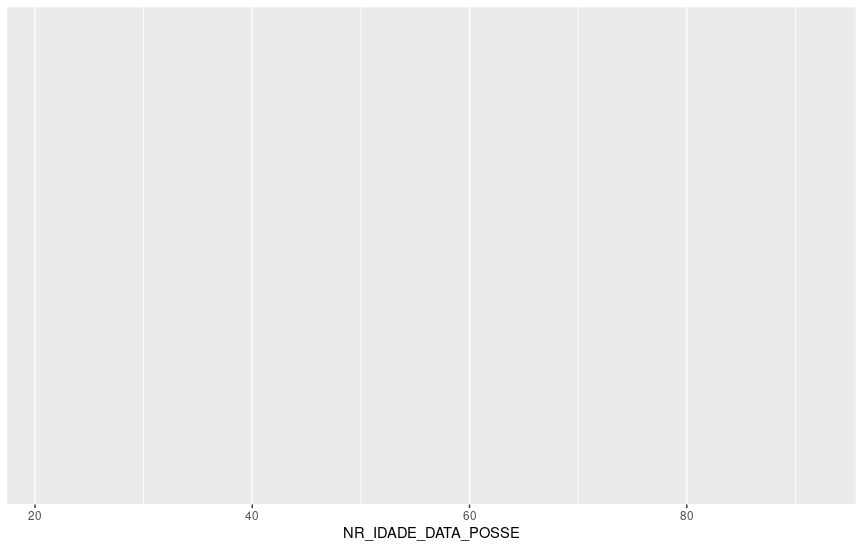

layout: true
  
<div class="my-footer"><span>


<a href="https://www.linkedin.com/in/hsvab/">LinkdIn</a> |
<a href="https://twitter.com/hsvab">Twitter</a> | 
<a href="https://www.instagram.com/haydeesvab/">Instagram</a> |
<a href="https://www.facebook.com/haydee.svab/">Facebook</a> |
<a href="https://github.com/hsvab">GitHub</a>


</span></div> 


---

class:

# Agenda do Curso

- Aula 1: Introdução ao R e ao RStudio

- Aula 2: Primeiros passos com R (R base)

- Aula 3: Pacote tidyverse, abertura e manipulação de dados

- Aula 4: Tratando dados

- Aula 5: Estatísticas básicas

- **Aula 6: Visualizando dados**

- Aula 7: Comunicando resultados com Markdown


---
class:    

# Agenda de hoje

- Breve recapitulação

- Bases de dados do R

- Pacote `ggplot`

- Histograma

- Gráfico de barras

- Gráfico de pontos

- Pacote `esquisse`

- Para aprender mais & referências


---
class: center, middle

## Breve recapitulação

```{r setup, include=FALSE}
options(htmltools.dir.version = FALSE)

knitr::opts_chunk$set(fig.align = "center", message=FALSE, warning=FALSE)

library(tidyverse)

```

---
class: center

# Recapitulando - Pré-requisitos

## - `R` e `RStudio` instalados no seu notebook 

```{r, echo=FALSE, out.width="25%"}
knitr::include_graphics("img/rlogos/rstudio-r.jpg")
```

## <center><b>OU</b></center> 

## - `RStudio` Cloud

```{r, echo=FALSE, out.width="30%"}
knitr::include_graphics("img/rstudiocloud.PNG")
```
Link da aula:
[https://bit.ly/rstudiocloud-curso-sesc](https://bit.ly/rstudiocloud-curso-sesc)

Não esqueça de fazer uma cópia do projeto


---

class:    

# Recapitulando - Atalhos

`CTRL + ENTER`: executa a linha selecionada no script

`ALT` + **`-`** gera o operador **<-**

`CTRL` + `SHIFT` + `M` gera o operador pipe **%>%**

<center></center> 


---

class:    

# Recapitulando - Pacotes

### Instalar

- Via CRAN: install.packages("nome-do-pacote").

```{r, include=TRUE, eval = FALSE }
install.packages("ggplot2")
```

### Carregar

```{r, include=TRUE, eval = FALSE }
library(ggplot2)
```

### Lembretes

- Você só precisa instalar o pacote uma vez, mas precisa carregá-lo sempre que começar uma nova sessão
- Se já instalou o tidyverse o ggplot2 já está na sua máquina


---
class: center, middle

## Bases de dados do R

---

class:

# Bases de dados do R

Há várias maneiras de se encontrar os datasets (os bases de dados) disponíveis no R:

1) Para ver a lista de datasets oriundos do R básico, de todos os pacotes carregados:

`data()`

2) Para ver todos os datasets disponiveis em todos os nossos pacotes baixados, mesmo que não tenhamos carregado eles:

`data(package = .packages(all.available = TRUE))`

3) Para ver os datasets oriundos de um pacote específico;

`data(package = "packagename")`

Exemplo:

`data(package = "dplyr")` retornará todos os datasets disponiveis no pacote do dplyr 


---
class: center, middle

## Pacote ggplot


---

class:

# Pacote ggplot

- É um pacote voltado para a visualização de dados.

- Se baseia em um conceito chamado **grammar of graphics**

- Faz parte do conjunto de pacotes do `tidyverse`

- Foi criado pelo Hadley Wickam

**Grammar of Grafics** é um conjuntop de conceitos e definições sobre o que é um gráfico e são oriundos do livro *Grammar of Graphics* ("Gramática dos Gráficos") de Leland Wilkinson.


---

class:

# Pacote ggplot

**Gramática da língua portuguesa** -> estabelece regras para a combinação de palavras, frases e sentenças visando a combinação desses componentes para a produção de sentenças válidas (ou gramaticalmente corretas)

--

**Gramática dos gráficos** -> conjunto de regras para a combinação de certos *componentes gráficos* para a construção de gráficos.

Exemplos de *componentes gráficos*:

- dado a ser usado para gerar o gráfico,
- um sistema de coordenadas (eixo x e eixo y),
- etc.


---

class:

# Pacote ggplot

## Template de gráfico no ggplot

Todo gráfico começa com o comando `ggplot()` que precisa no mínimo de dois argumentos:

- o dataset que queremos usar [argumento data]
- o componente do dado que queremos representar no gráfico [argumento aes]

`ggplot(data = meu_dataframe, aes(variaveis_a_ser_representadas_no_grafico))`


---

class:

# Pacote ggplot

## Template de gráfico no ggplot

Além disso, também é preciso definir o tipo de gráfico desejado [função geom]

`ggplot(data = meu_dataframe, aes(variaveis_a_ser_representadas_no_grafico)) +`
  `geom_xxx(argumentos_para_mudar_a_aparencia_do_geom) +`
  
*Observação: notar que cada camada adicionada no ggplot é acrescentada utilizado o +*


---

class:

# Pacote ggplot

## Template de gráfico no ggplot

Para modificarmos a aparência do nosso geom podemos passar argumentos para essa 
função, bem como definir nomes de eixos, título e legendas, da seguinte maneira:

`ggplot(data = meu_dataframe, aes(variaveis_a_ser_representadas_no_grafico)) +`
  `geom_xxx(argumentos_para_mudar_a_aparencia_do_geom) +`
  `theme_xxx(argumentos_para_mudar_aparencia_geral_do_grafico) +`
  `labs(adiciona_nomes_dos_eixos_e_titulo)`


---
class: center, middle

## Histograma


---

class:

# Histograma

Usando a base de dados `diamonds`, disponível no pacote do ggplot, faça o histograma do preço (price)

```{r, include=TRUE, eval = FALSE }
# Carga da base de dados
diamantes <- ggplot2::diamonds
```

---

class:

# Histograma

Usando a base de dados `diamonds`, disponível no pacote do ggplot, faça o histograma do preço (price)

```{r, include=TRUE, eval = FALSE }
# Gráfico com ggplot
ggplot(data = diamantes, aes(x=price)) +
  geom_histogram() +
  theme_bw() +
  labs(x = "Preço (em dolares)", y = "Frequência", title = "Distribuição dos valores dos diamantes")
```

```{r, echo=FALSE, out.width="50%"}

```


---
class: center, middle

## Desafio 1


---
class:    

# Desafio 1

No seu script R, usando a base candidatos_com_bens_sp.csv fazer o histograma mostrando a distribuição dos valores dos bens dos(as) candidatos(as) de SP


---
class:    

# Desafio 1 - resposta

Usando a base candidatos_com_bens_sp.csv fazer o histograma mostrando a distribuição da idade na data de posse em SP

```{r, include=TRUE, eval = FALSE }
# Leitura do arquivo com todas informações de candidatos(as) e bens de São Paulo
df_candidatos_com_bens_sp <- data.table::fread(file = "./data/candidatos_com_bens_sp.csv",
                                               encoding = "Latin-1")

# Gráfico com ggplot passando os parâmetros mínimos
ggplot(data = df_candidatos_com_bens_sp, aes(x = NR_IDADE_DATA_POSSE))
```

```{r, echo=FALSE, out.width="50%"}

```

---

class:

# Desafio 1 - resposta

Usando a base candidatos_com_bens_sp.csv fazer o histograma mostrando a distribuição da idade na data de posse em SP

```{r, include=TRUE, eval = FALSE }
# Gráfico com ggplot passando os parâmetros mínimos e definindo o tipo do geom
ggplot(data = df_candidatos_com_bens_sp, aes(x = NR_IDADE_DATA_POSSE)) +
  geom_histogram()
```

```{r, echo=FALSE, out.width="50%"}

```


---

class:

# Desafio 1 - resposta

Usando a base candidatos_com_bens_sp.csv fazer o histograma mostrando a distribuição da idade na data de posse em SP

```{r, include=TRUE, eval = FALSE }
# Gráfico com ggplot passando os parâmetros mínimos, definindo o tipo do geom e o tema
ggplot(data = df_candidatos_com_bens_sp, aes(x = NR_IDADE_DATA_POSSE)) +
  geom_histogram() +
  theme_minimal()
```

```{r, echo=FALSE, out.width="50%"}

```

[Para conhecer mais temas disponíveis visitar a página ggplot2.tidyverse.org](https://ggplot2.tidyverse.org/reference/ggtheme.html)

---

class:

# Desafio 1 - resposta

Usando a base candidatos_com_bens_sp.csv fazer o histograma mostrando a distribuição da idade na data de posse em SP

```{r, include=TRUE, eval = FALSE }
# Gráfico com ggplot passando os parâmetros mínimos, o tipo do geom, o tema e os rótulos de eixo
ggplot(data = df_candidatos_com_bens_sp, aes(x = NR_IDADE_DATA_POSSE)) +
  geom_histogram() +
  theme_minimal() +
  labs(x = "Idade", y = "Frequência",
       title = "Distribuição da Idade na Data de Posse em SP")
```

```{r, echo=FALSE, out.width="50%"}

```


```{r, include=TRUE, eval = FALSE }
# Gráfico com ggplot passando os parâmetros mínimos e definindo o tipo do geom
ggplot(data = df_candidatos_com_bens_sp, aes(x = NR_IDADE_DATA_POSSE)) +
  geom_histogram() +
  theme_minimal() +
  labs(x = "Idade", y = "Quantidade de candidatos(as)",
       title = "Distribuição da Idade na Data de Posse em SP")
```


---
class: center, middle

## Gráfico de barras


---

class:

# Gráfico de barras

Há dois tipos de gráficos de barras:

- geom_bar()
- geom_col()

Deve-se usar `geom_bar()` quando se deseja a altura da barra proporcional ao número de casos em cada grupo

Deve-se usar `geom_col()` quando se deseja que as alturas das barras sejam valores presentes nos dados

---

class:

# Gráfico de barras

Usando a base de dados `Cars93`, disponível no pacote MASS, faça um gráfico de barras dos tipos de carro (Type)

```{r, include=TRUE, eval = FALSE }
# Carga da base de dados
library(MASS)
carros <- Cars93

# Gráfico com ggplot passando os parâmetros mínimos e o tipo do geom
ggplot(data = carros, aes(x = Type)) +
  geom_bar()
```

```{r, echo=FALSE, out.width="50%"}

```


---

class:

# Gráfico de barras

Usando a base de dados `Cars93`, disponível no pacote MASS, faça um gráfico de barras dos tipos de carro (Type)

```{r, include=TRUE, eval = FALSE }
# Gráfico com ggplot passando os parâmetros mínimos, tipo do geom, tema e labels
ggplot(data = carros, aes(x = Type)) +
  geom_bar() +
  theme_classic() +
  labs(x = "Tipo de carro", y = "Frequência", title = "Tipo de carro na base Cars93")
```

```{r, echo=FALSE, out.width="50%"}

```


---

class:

# Gráfico de barras

Usando a base de dados `Cars93`, disponível no pacote MASS, faça um gráfico de barras dos tipos de carro (Type)

```{r, include=TRUE, eval = FALSE }
# Gráfico com ggplot passando os parâmetros mínimos, tipo do geom, tema, labels 
# e rótulo de valores nas barras
ggplot(data = carros, aes(x = Type)) +
  geom_bar() +
  theme_classic() +
  labs(x = "Tipo de carro", y = "Frequência", title = "Tipo de carro na base Cars93") +
  geom_text(stat='count', aes(label=..count..), vjust=-0.5)
```

```{r, echo=FALSE, out.width="50%"}

```


---

class:

# Gráfico de barras

No seu script R, usando a base `candidatos_com_bens_sp.csv` fazer um gráfico de 
barras que mostre a quantidade de candidatos por partido em SP

```{r, include=TRUE, eval = FALSE }
ggplot(data = df_candidatos_partido, aes(x = NM_PARTIDO,
                                         y = QUANTIDADE_CANDIDATOS)) +
  geom_col() +
  theme_minimal() +
  labs(x = "Partidos",
       y = "Quantidade de candidatos(as)",
       title = "Quantidade de Candidatos(a) por Partido em SP")
```

```{r, echo=FALSE, out.width="50%"}

```


---

class:

# Gráfico de barras

Reordenando os valores de x, segundo os valores de y

```{r, include=TRUE, eval = FALSE }
ggplot(data = df_candidatos_partido, aes(x = reorder(NM_PARTIDO, QUANTIDADE_CANDIDATOS),
                                         y = QUANTIDADE_CANDIDATOS)) +
  geom_col() +
  theme_minimal() +
  labs(x = "Partidos",
       y = "Quantidade de candidatos(as)",
       title = "Quantidade de Candidatos(a) por Partido em SP")
```

```{r, echo=FALSE, out.width="50%"}

```


---

class:

# Gráfico de barras

Rotacionando 90 graus os textos do eixo x

```{r, include=TRUE, eval = FALSE }
ggplot(data = df_candidatos_partido, aes(x = reorder(NM_PARTIDO, QUANTIDADE_CANDIDATOS),
                                         y = QUANTIDADE_CANDIDATOS)) +
  geom_col() +
  theme_minimal() +
  labs(x = "Partidos",
       y = "Quantidade de candidatos(as)",
       title = "Quantidade de Candidatos(a) por Partido em SP")+
  theme(axis.text.x = element_text(angle = 90))
```

```{r, echo=FALSE, out.width="50%"}

```


---

class:

# Gráfico de barras

Invertendo eixos x e y

```{r, include=TRUE, eval = FALSE }
ggplot(data = df_candidatos_partido, aes(x = reorder(NM_PARTIDO, QUANTIDADE_CANDIDATOS),
                                         y = QUANTIDADE_CANDIDATOS)) +
  geom_col() +
  theme_minimal() +
  labs(x = "Partidos",
       y = "Quantidade de candidatos(as)",
       title = "Quantidade de Candidatos(a) por Partido em SP")+
  theme(axis.text.x = element_text(angle = 90)) +
  coord_flip()
```

```{r, echo=FALSE, out.width="50%"}

```


---

class:

# Gráfico de barras

Acrescentando rótulos de valores nas barras

```{r, include=TRUE, eval = FALSE }
ggplot(data = df_candidatos_partido, aes(x = reorder(NM_PARTIDO, QUANTIDADE_CANDIDATOS),
                                         y = QUANTIDADE_CANDIDATOS)) +
  geom_col() +
  theme_minimal() +
  labs(x = "Partidos",
       y = "Quantidade de candidatos(as)",
       title = "Quantidade de Candidatos(a) por Partido em SP")+
  theme(axis.text.x = element_text(angle = 90)) +
  coord_flip() +
  geom_text(aes(label=QUANTIDADE_CANDIDATOS), hjust=-0.5)
```

```{r, echo=FALSE, out.width="50%"}

```


---
class: center, middle

## Gráfico de pontos


---

class:

# Gráfico de pontos

Usando a base de dados `mpg`, que traz dados de economia de combustível de 1999 a 2008 para 38 modelos populares de carros, faça um gráfico de pontos de displ (engine displacement in liters - cilidradas em litros) por hwy (highway miles per gallon - milhas por galão)

```{r, include=TRUE, eval = FALSE }
# Carga da base de dados
dados_economia_combustivel <- mpg

# Gráfico com ggplot passando os parâmetros mínimos e o tipo do geom
ggplot(data = dados_economia_combustivel, aes(x = displ, y = hwy)) +
  geom_point()
```

```{r, echo=FALSE, out.width="50%"}

```


---

class:

# Gráfico de pontos

Colorindo segundo a classe do veículo

```{r, include=TRUE, eval = FALSE }
# Gráfico com ggplot passando os parâmetros mínimos e o tipo do geom
ggplot(data = dados_economia_combustivel, aes(x = displ, y = hwy)) +
  geom_point(aes(color = class))
```

```{r, echo=FALSE, out.width="70%"}

```


---

class:

# Gráfico de pontos

Acrescentando linha de tendência e bandas do intervalo de confiança (padrão é 95%)

```{r, include=TRUE, eval = FALSE }
# Gráfico com ggplot passando os parâmetros mínimos e o tipo do geom
ggplot(data = dados_economia_combustivel, aes(x = displ, y = hwy)) +
  geom_point(aes(color = class)) +
  geom_smooth()
```

```{r, echo=FALSE, out.width="70%"}

```


---
class: center, middle

## Pacote esquisse


---

class:    

# Pacote esquisse

## Instalar & Carregar

```{r, include=TRUE, eval = FALSE }
install.packages("esquisse")
library(esquisse)
```

## Como usar

```{r, echo=FALSE, out.width="70%"}

```


---
class: center, middle

## Desafio 2


---

class:    

# Desafio 2

Usando o pacote `esquisse` e a base de dados `candidatos_com_bens_sp.csv` fazer um gráfico de pontos do valor dos bens de candidatos(as) por idade na data da posse, colorindo segundo o genero e separando segundo cor/raça.

Ao final, copiar o código para seu script R.


---

class:    

# Desafio 2 - resposta

```{r, echo=FALSE, out.width="110%"}

```


---

class:    

# Desafio 2 - resposta

```{r, include=TRUE, eval = FALSE }
ggplot(df_candidatos_com_bens_sp) +
  aes(
    x = VR_BEM_CANDIDATO,
    y = NR_IDADE_DATA_POSSE,
    colour = DS_GENERO
  ) +
  geom_point(shape = "circle", size = 1.5) +
  scale_color_hue(direction = 1) +
  theme_minimal() +
  facet_wrap(vars(DS_COR_RACA))
```

---
class:    

# Para aprender mais & referências:

- [Pacote esquisse](https://cran.r-project.org/web/packages/esquisse/vignettes/get-started.html) <br></br>
- [Pacote ggplot2](https://ggplot2.tidyverse.org/) <br></br>
- [geom_histogram](https://ggplot2.tidyverse.org/reference/geom_histogram.html) <br></br>
- [geom_bar e geom_col](https://ggplot2.tidyverse.org/reference/geom_bar.html) <br></br>
- [geom_point](https://ggplot2.tidyverse.org/reference/geom_point.html) <br></br>
- [geom_smooth](https://ggplot2.tidyverse.org/reference/geom_smooth.html) <br></br>
- [Livro `R` for Data Science](https://r4ds.had.co.nz) <br></br>
- [Repositório RLadies São Paulo](https://github.com/rladies/meetup-presentations_sao-paulo) <br></br>
- [Storytelling com Dados](https://www.amazon.com.br/Storytelling-com-Dados-Visualiza%C3%A7%C3%A3o-Profissionais/dp/8550804681) <br></br>


---
class:center

# Agradecimentos

Diego Rabatone Oliveira
```{r echo=FALSE, out.width="20%"}
 
```

Capítulo RLadies São Paulo
```{r echo=FALSE, out.width="20%"}
knitr::include_graphics("img/rlogos/r-ladies-sp.png") 
```

Apresentação feita com [RMarkdown](https://rmarkdown.rstudio.com/) e [Xaringan](https://github.com/yihui/xaringan), <br>
com o tema `metropolis` modificado por Bea Milz e Haydee Svab


---
class: middle

<center></center>
