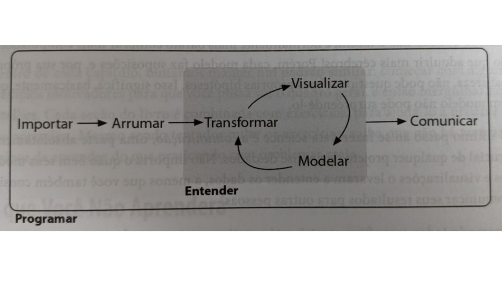
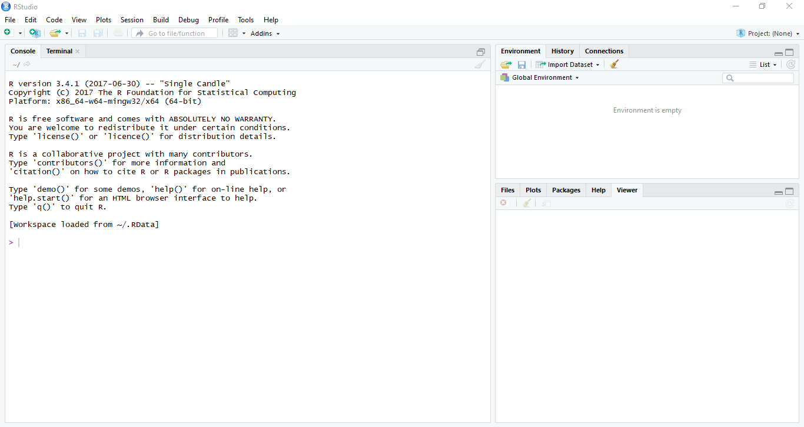
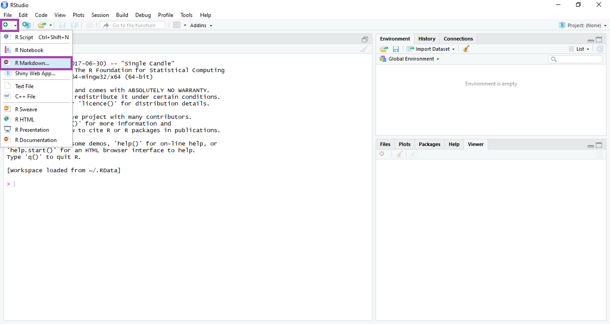
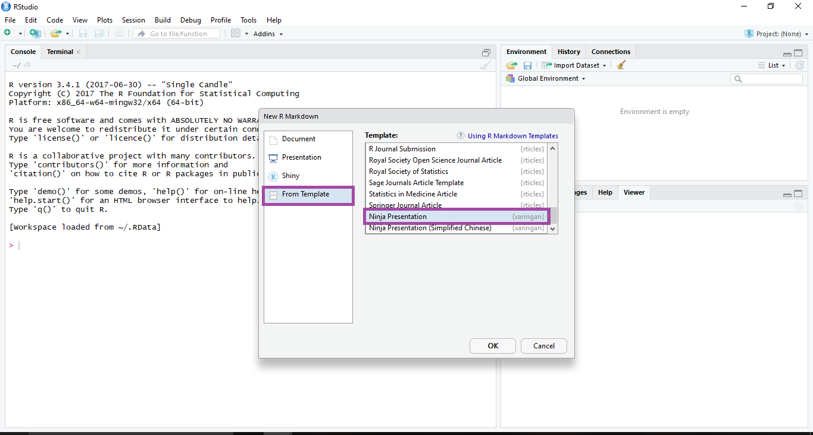
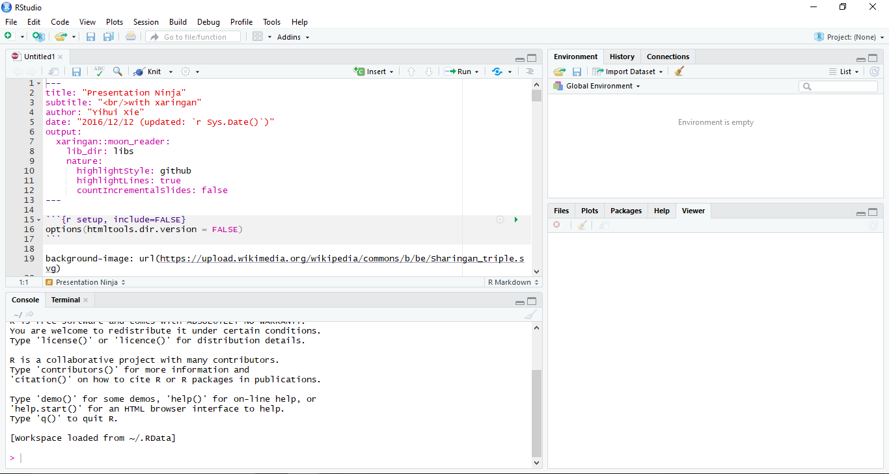
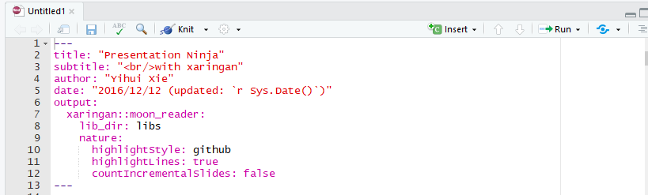
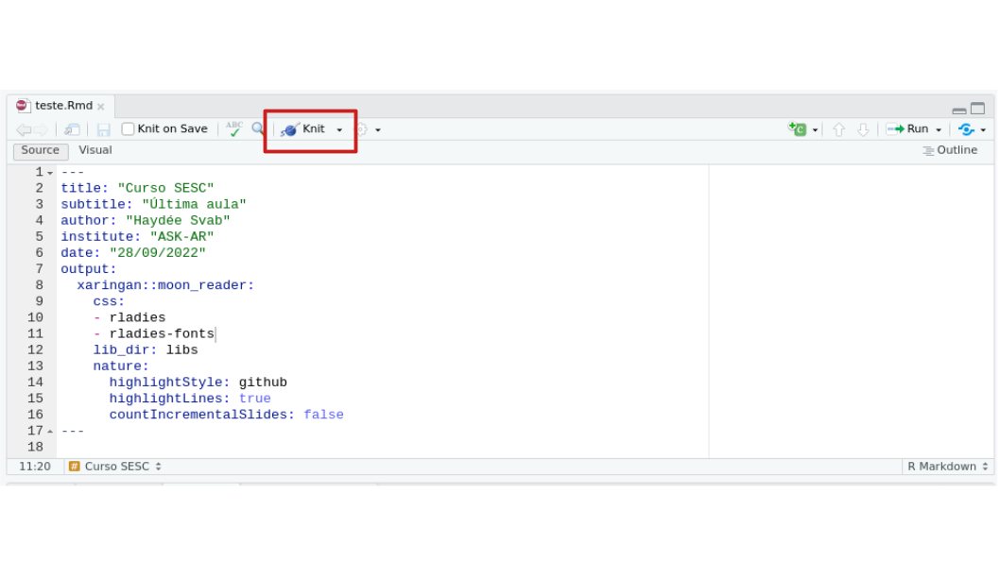
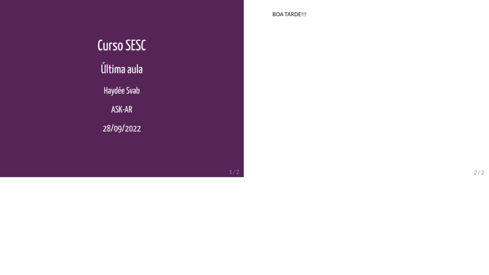
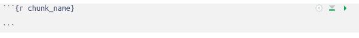
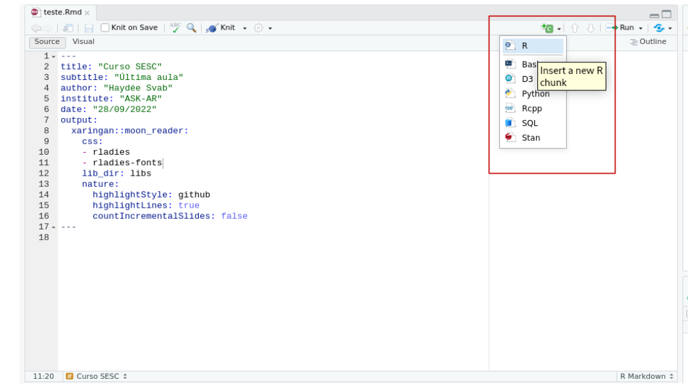

layout: true
  
<div class="my-footer"><span>


<a href="https://www.linkedin.com/in/hsvab/">LinkdIn</a> |
<a href="https://twitter.com/hsvab">Twitter</a> | 
<a href="https://www.instagram.com/haydeesvab/">Instagram</a> |
<a href="https://www.facebook.com/haydee.svab/">Facebook</a> |
<a href="https://github.com/hsvab">GitHub</a>


</span></div> 


---

class:

# Agenda do Curso

- Aula 1: Introdução ao R e ao RStudio

- Aula 2: Primeiros passos com R (R base)

- Aula 3: Pacote tidyverse, abertura e manipulação de dados

- Aula 4: Tratando dados

- Aula 5: Estatísticas básicas

- Aula 6: Visualizando dados

- **Aula 7: Comunicando resultados com Markdown**


---
class:    

# Agenda de hoje

- Breve recapitulação

- Comunicando resultados

- Rmarkdown

- Markdown

- Pacote Xaringan

- Pacote Knitr

- Chunks de Código R

- Para aprender mais & referências


---
class: center, middle

## Breve recapitulação

```{r setup, include=FALSE}
options(htmltools.dir.version = FALSE)

knitr::opts_chunk$set(fig.align = "center", message=FALSE, warning=FALSE)

library(tidyverse)

```

---
class: center

# Recapitulando - Pré-requisitos

## - `R` e `RStudio` instalados no seu notebook 

```{r, echo=FALSE, out.width="25%"}

```

## <center><b>OU</b></center> 

## - `RStudio` Cloud

```{r, echo=FALSE, out.width="30%"}
knitr::include_graphics("img/rstudiocloud.PNG")
```
Link da aula:
[https://bit.ly/rstudiocloud-curso-sesc](https://bit.ly/rstudiocloud-curso-sesc)

Não esqueça de fazer uma cópia do projeto


---

class:    

# Recapitulando - Atalhos

`CTRL + ENTER`: executa a linha selecionada no script

`ALT` + **`-`** gera o operador **<-**

`CTRL` + `SHIFT` + `M` gera o operador pipe **%>%**

<center></center> 


---

class:    

# Recapitulando - Pacotes

### Instalar

- Via CRAN: install.packages("nome-do-pacote").

```{r, include=TRUE, eval = FALSE }
install.packages("rmarkdown")
install.packages("knitr")
install.packages("devtools")
devtools::install_github("yihui/xaringan")
install.packages("DT")
```

### Carregar

```{r, include=TRUE, eval = FALSE }
library(rmarkdown)
library(xaringan)
library(knitr)
library(DT)
```


### Lembretes

- Você só precisa instalar o pacote uma vez, mas precisa carregá-lo sempre que começar uma nova sessão

---
class: center, middle

## Comunicando resultados

---

class:

# Comunicando resultados

## Por que apresentações são importantes? 

É uma das formas de comunicar os resultados!

```{r echo=FALSE, out.width="90%"}

```

Fonte: [R for Data Science](http://r4ds.had.co.nz/)


---

class:

# Comunicando resultados

## Formas de criar apresentações no `R`

- Pacote `Xaringan` - Utiliza `RMarkdown` e a biblioteca remark.js do JavaScript para criação de apresentações

- Outras formas:
      * output: **beamer_presentation** ->  beamer (pdf)
      
      * output: **ioslides_presentation** -> ioslides (HTML) 
      
      * output: **slidy_presentation** ->  slidy (HTML)


---
class: center, middle

## RMarkdown


---

class:

# RMarkdown

### O que é?

- É um formato de arquivo usado para criar documentos dinâmicos com R.

- Um documento `RMarkdown` é escrito em **markdown** (uma linguagem de marcação e também
um formato de texto simples fácil de escrever) e contém pedaços de código R incorporado.

---

class:

# RMarkdown

### Vantagens:

- É um tipo de arquivo que suporta códigos em R, texto, markdown e outros formatos.

- Apresenta os seus códigos, seus resultados, e também seus comentários.

- Arquivos **.Rmd** são reprodutíveis, portanto, é interessante para trabalhar 
em equipe, para comunicar seus resultados, e para desenvolver seus códigos em R.


---

class:

# RMarkdown

- Possibilita exportar diferentes tipos de arquivos.

```{r echo=FALSE, fig.align='center', out.width="50%"}
knitr::include_graphics("img/markdown.png")
```


---
class: center, middle

## Markdown


---

class:

# Markdown

- Desenvolvido em 2004 por [John Gruber](https://en.wikipedia.org/wiki/John_Gruber) e [Aaron Swartz](https://pt.wikipedia.org/wiki/Aaron_Swartz)

- Markdown é uma **linguagem de marcação** simples. 

*Uma linguagem de marcação é um conjunto de sinais e códigos aplicados a um*
*texto ou a dados para definir a sua configuração / formatação. *
*A marcação em si feita no texto não aparece no trabalho final, apenas seu efeito.*

- Elaborada para ser fácil de ler, fácil de escrever.

- Documento feito em Markdown ode ser convertido facilmente em texto para HTML (Hypertext Markup Language).

- Pode ser usada para fazer: sites, documentos, notas, apresentações, e-mail e mensagens.


---

class:

# Markdown

## Marcações de texto simples

_Itálico_: `_italics_`

ou

*Itálico*: `*italics*`

--

**Negrito**: `**bold**` 


---

class:

# Markdown

## Adicionar títulos

`# Título 1`

`## Título 2`

`### Título 3` 

E assim por diante...


---

class:

# Markdown

## Fazendo uma lista

É possível fazer uma lista escrevendo com asteriscos, como a seguir:

Pacotes que conheci neste curso:

`* tidyverse`

`* ggplot2`

`* rmarkdown`

`* xaringan`


Como vai aparecer sua lista:

* tidyverse
* ggplot2
* rmarkdown
* xaringan

---

class:

# Markdown

## Fazendo uma lista

Também é possível fazer uma lista escrevendo com hífens, como a seguir:

Pacotes que conheci neste curso:

`- tidyverse`

`- ggplot2`

`- rmarkdown`

`- xaringan`

Como vai aparecer sua lista:

- tidyverse
- ggplot2
- rmarkdown
- xaringan


---

class:

# Markdown

## Fazendo uma lista enumerada

É possível fazer uma lista numerada usando somente números. 
Você pode usar o mesmo número quantas vezes quiser: 

Pacotes que conheci neste curso:

`1. tidyverse`

`1. ggplot2`

`1. rmarkdown`

Como vai aparecer sua lista:

1. tidyverse
1. ggplot2
1. rmarkdown


---

class:

# Markdown

## Adicionando um hiperlink num texto

Você pode fazer um hiperlink dessa forma:

`[**texto para mostrar**](http://the-web-page.com)`

[**texto para mostrar**](http://the-web-page.com)

---

class:

# Markdown

## Incluindo arquivo de imagem

Você pode incluir arquivo de imagem dessa forma:

``


---

class:

# Markdown

## Incluindo equações matemáticas

Se você sabe e mexe com LaTeX, pode usar `$$` para inserir equações matemáticas, como: 

```{r}
# $$y = \mu + \sum_{i=1}^p \beta_i x_i + \epsilon$$
```

$$y = \mu + \sum_{i=1}^p \beta_i x_i + \epsilon$$


---
class: center, middle

## Pacote Xaringan

---

class:    

# Pacote Xaringan


- É um pacote do R para criar apresentações usando o  [remark.js](http://remarkjs.com) através do RMarkdown.

```{r echo=FALSE, out.width="20%"}
knitr::include_graphics("img/xaringan.PNG")
```

- O pacote foi criado por [**Yihui Xie**](https://yihui.name/), que é desenvolvedor de software na RStudio.

- [**Yihui Xie**](https://yihui.name/) também desenvolveu os seguintes pacotes: [knitr](https://yihui.name/knitr/), [animation](https://yihui.name/animation/), [bookdown](https://bookdown.org/), [blogdown](https://github.com/rstudio/blogdown), [pagedown](https://github.com/rstudio/blogdown) e [tinytex](https://yihui.name/tinytex/). 

---

class:    

# Pacote Xaringan

## Pré-requisitos

- [R](https://www.r-project.org/)

- [RStudio](https://www.rstudio.com/)

- Pacote [RMarkdown](https://rmarkdown.rstudio.com/)

- Pacote [Xaringan](https://github.com/yihui/xaringan) 

- Pacote [knitr](http://yihui.name/knitr/)

- Google Chrome ou Chromium

---

class:    

# Pacote Xaringan

## Inicie o RStudio

```{r echo=FALSE, out.width="100%"}

```

---

class:    

# Pacote Xaringan

## Crie um novo arquivo RMarkdown

```{r echo=FALSE, out.width="90%"}

```


---

class:    

# Pacote Xaringan

## Selecione o template Ninja Presentation
```{r echo=FALSE, out.width="100%"}

```

Dica: para facilitar posteriormente, crie a sua apresentação com o nome de `index.Rmd`


---

class:    

# Pacote Xaringan

## RMarkdown com o Ninja Presentation

```{r echo=FALSE, out.width="100%"}

```


---

class:    

# Pacote Xaringan

## yaml - metadados do documento

- **y**et **a**nother **m**arkup **l**anguage 
- Cuidado com a **identação**
- Controla muitas das configurações do documento

```{r echo=FALSE, out.width="90%"}

```


---

class:    

# Pacote Xaringan

## yaml - metadados do documento

```{r echo=FALSE, out.width="90%"}

```

- title: título
- subtitle: subtítulo
- author: autor
- date: data
- output: formato (Ex: html_document, pdf_document, etc). No caso do Xaringan, o output é **xaringan::moon_reader**  
   - libs_dir: pasta onde colocará bibliotecas necessárias (ex. remark-latest.min.js)


---

class:    

# Pacote Xaringan

## Quais são os temas disponíveis?

Depende da versão do Xaringan que está usando:

```{r}
names(xaringan:::list_css())
```

Alguns exemplos de temas disponíveis: [xaringan themes](https://github.com/yihui/xaringan/wiki/Themes)


---

class:    

# Pacote Xaringan

## Encoding

Para evitar problemas de codificação, adicione o encoding no yaml:

```{r eval=FALSE}
encoding: "UTF-8"
```

Vale ler o texto do blog do Yihui:

[My Biggest Regret in the knitr Package
UTF-8, and UTF-8 only, or we cannot be friends](https://yihui.name/en/2018/11/biggest-regret-knitr/)


---
class: center, middle

## Pacote Knitr

---

class:    

# Pacote Knitr

Após criar seu arquivo .Rmd, apague o que vem depois do yaml, digite BOA TARDE! 
e **aperte o Knit**:

```{r echo=FALSE, out.width="100%"}

```


---

class:    

# Pacote Knitr

## Resultado

- O knit exportará um arquivo do tipo html

- Agora o tema da apresentação está configurado!

```{r echo=FALSE, out.width="100%"}

```

---

class:    

# Pacote Knitr

## DEU ERRO NO KNITR!

### Calma!

É bem comum dar erro ao compliar o arquivo pois **qualquer** código errado causa isso.
Algumas coisas pra se observar:

- **Yaml header** - se algo estiver errado, vai dar erro ao compilar. 
Muito cuidado com a identação!

- **Código nos chunks** - teste o _Run All Chunks_ e veja se dá erro em algum específico.
Se descobrir, tente verificar o que há de errado no código (pode ser a falta de um parênteses, vírgula, entre outros).

```{r echo=FALSE, out.width="30%"}
knitr::include_graphics("https://media.giphy.com/media/j9GASQ5ocrIRicnmyq/giphy.gif")
```


---
class: center, middle

## Chunks de Código R


---

class:    

# Chunks de Código R

### É possível inserir código de R em um arquivo RMarkdown

```{r echo=FALSE, fig.align='center'}

```

É uma boa ideia dar a cada chunk um nome, pois ele podem ajudar a corrigir erros,
e, se quaisquer gráficos são produzidos, os nomes dos arquivos serão baseados no 
nome do chunk de código.


---

class:    

# Chunks de Código R

## Como criar um chunk de código?

*Atalho do teclado para criar chunks:  `Ctrl + ALt + I`.*

```{r echo=FALSE, fig.align='center', out.width="100%"}

```


---

class:    

# Chunks de Código R

## Opções de chunk

Há uma variedade de opções que podem afetar como os chunks de código são tratados.

- `echo=FALSE` -> evita que o próprio código apareça

- `results="hide"` -> evita que qualquer resultado seja impresso

- `include=FALSE` -> evita que o código apareça e que o resultado seja impresso, mas executa o que está no chunk de código e seus resutlados ficam disponíveis no environment para uso de outros chunks

- `eval=FALSE` -> o código não é executado, independente de mostrar o código ou não

- `message=FALSE` -> oculta qualquer messagem produzida pelo código

- `warning=FALSE` -> oculta qualquer aviso produzido pelo código

- `out.width` -> controla o tamanho de figuras produzidas (Ex: `out.width = "100%"`)


---

class:    

# Chunks de Código R

## Código R no texto

Você pode fazer com que todo número em seu relatório seja reproduzível. 

```{r}
# Use `r e ` para um chunk de código "in-line".
# O código será executado e substituído com o valor do resultado.

```

Exemplo: 
```{r eval=FALSE, include=TRUE}
`r round(3.14159265359, 2)`
```

`r round(3.14159265359, 2)`

Não deixe que esse chunk _in-line_ seja separado através das linhas.

 
---

class:    

# Chunks de Código R

## Código em R no texto

Outro exemplo:

```{r eval=FALSE, include=TRUE}
# O dataframe mtcars possui `r nrow(mtcars)` carros. 
```

O dataframe mtcars possui `r nrow(mtcars)` carros.


---

class:    

# Chunks de Código R

## Adicionando um gráfico

```{r include=FALSE}
library(tidyverse)
```

```{r message=FALSE, warning=FALSE, out.width="50%"}
ggplot(data = mtcars, aes(x = wt, y = mpg)) + geom_point() + geom_smooth()
```

Fonte do exemplo: http://stcorp.nl/R_course/tutorial_ggplot2.html


---

class:    

# Chunks de Código R

## Adicionando uma tabela

```{r, eval=FALSE}
candidatos_com_bens_sp <- data.table::fread("data/candidatos_com_bens_sp.csv") %>%
  select(NR_CANDIDATO, NM_CANDIDATO, SG_UF, SG_PARTIDO, VR_BEM_CANDIDATO)
DT::datatable(candidatos_com_bens_sp)
```


---

class:    

# Chunks de Código R

## Adicionando uma tabela

```{r, echo=FALSE}
candidatos_com_bens_sp <- data.table::fread("data/candidatos_com_bens_sp.csv") %>%
  select(NR_CANDIDATO, NM_CANDIDATO, SG_UF, SG_PARTIDO, VR_BEM_CANDIDATO)
DT::datatable(candidatos_com_bens_sp, options = list(pageLength=4))
```

---

class:    

# Chunks de Código R

## Adicionando imagens usando Knitr

Função: `knitr::include_graphics()`

Exemplo:
```{r  out.width = "30%"}
knitr::include_graphics("https://www.r-project.org/Rlogo.png")
```

---

class:    

# Chunks de Código R

## Adicionando imagens usando Knitr: opções

**Tamanho da imagem**

- `out.width = "50%"`

```{r echo=FALSE, out.width = "45%"}
knitr::include_graphics("https://www.r-project.org/Rlogo.png")
```

Observação: [Para conhecer mais opções do KnitR](https://yihui.name/knitr/options/#chunk-options)


---

class:    

# Chunks de Código R

## Adicionando imagens usando Knitr: opções

**Alinhamento da figura**
- `fig.align = 'center', 'default', **'left'**,'right'` 

```{r echo=FALSE,  out.width="20%", fig.align='left'} 
knitr::include_graphics("https://www.r-project.org/Rlogo.png")
```

- `fig.align = 'center', 'default', 'left', **'right' **`

```{r echo=FALSE,  out.width="20%", fig.align='right'}
knitr::include_graphics("https://www.r-project.org/Rlogo.png")
```

---

class:    

# Chunks de Código R

## Adicionando imagens usando Knitr: opções

**Legenda de figura**

- `fig.cap="Logotipo do R"`

```{r echo=FALSE,  out.width="30%", fig.cap="Logotipo do R", fig.align='left'}
knitr::include_graphics("https://www.r-project.org/Rlogo.png")
```


---

class:    

# Salvar a versão em PDF

- O autor do pacote disse que a forma mais confiável é abrir no Google Chrome ou Chromium, e salvar como PDF - muitas vezes não dá certo com o Mozilla Firefox. 
Então, no navegador Chrome ou no Chromium, imprima para arquivo (Ctrl + P).

- Existe a função **chrome_print** do pacote `pagedown`: 

    - É recente e ainda está em desenvolvimento, portanto, pode apresentar instabilidade
    - Precisa ter o Chrome instalado

```{r eval=FALSE, include=TRUE}
remotes::install_github('rstudio/pagedown')
```

```{r eval=FALSE}
pagedown::chrome_print("index.html")
```

Referência: [Apresentação do Yihui na RStudio Conf 2019: pagedown - Creating beautiful PDFs with R Markdown and CSS](https://resources.rstudio.com/rstudio-conf-2019/pagedown-creating-beautiful-pdfs-with-r-markdown-and-css)


---
class:    

# Para aprender mais & referências

- [Markdown: saiba o que é e como usá-lo](https://www.digitalhouse.com/br/blog/markdown/)
- [Apresentação Yihui "Advanced RMarkdown"](https://slides.yihui.name/2017-rstudio-conf-rmarkdown-Yihui-Xie.html)
- [Livro R Markdown: The Definitive Guide](https://bookdown.org/yihui/rmarkdown/)
- [Livro R for Data Science - Cap 27: R Markdown](https://r4ds.had.co.nz/r-markdown.html)
- [RMarkdown Cheatsheet 2.0](http://www.rstudio.com/wp-content/uploads/2016/03/rmarkdown-cheatsheet-2.0.pdf)
- [RMarkdown Cheatsheet](https://www.rstudio.com/wp-content/uploads/2015/02/rmarkdown-cheatsheet.pdf)
- [RMarkdown from RStudio](https://rmarkdown.rstudio.com/lesson-1.html)
- [Livro R Markdown: Capítulo 7 - Apresentações com Xaringan](https://bookdown.org/yihui/rmarkdown/xaringan.html)
- [Apresentação da Documentação do pacote Xaringan](http://slides.yihui.name/xaringan/) 
- [Xaringan Wiki](https://github.com/yihui/xaringan/wiki)
- [Documentação do pacote knitr](https://www.rdocumentation.org/packages/knitr/versions/0.1/topics/knit)
- [Software Carpentry - Producing Reports With knitr](https://swcarpentry.github.io/r-novice-gapminder/15-knitr-markdown/)
- [Chunk Options with knitr](https://yihui.org/knitr/options/#chunk-options)
- [Code Chunks com RMarkdown](https://rmarkdown.rstudio.com/lesson-3.html)
- [Repositório RLadies São Paulo](https://github.com/rladies/meetup-presentations_sao-paulo)


---
class:center

# Agradecimentos

Diego Rabatone Oliveira
```{r echo=FALSE, out.width="20%"}
 
```

Capítulo RLadies São Paulo
```{r echo=FALSE, out.width="20%"}
knitr::include_graphics("img/rlogos/r-ladies-sp.png") 
```

Apresentação feita com [RMarkdown](https://rmarkdown.rstudio.com/) e [Xaringan](https://github.com/yihui/xaringan), <br>
com o tema `metropolis` modificado por Bea Milz e Haydee Svab


---
class: middle

<center></center>
